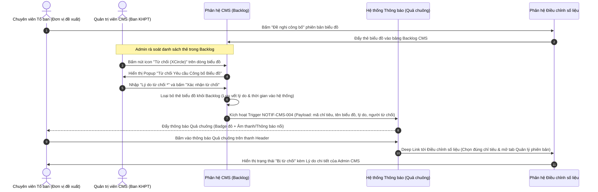

# TỔNG CÔNG TY HÀNG KHÔNG VIỆT NAM (VIETNAM AIRLINES)
## CỔNG THÔNG TIN NET ZERO & HỆ THỐNG BÁO CÁO ESG PHÁT TRIỂN BỀN VỮNG
---
### TÀI LIỆU ĐẶC TẢ BA: KỊCH BẢN THÔNG BÁO QUẢ CHUÔNG (NOTIFICATION SPECIFICATION)
* **Phân hệ áp dụng**: CMS (Cổng Quản trị Nội dung) & Điều chỉnh số liệu công bố (Publish Adjustment)
* **Tệp bảng tính Excel đính kèm**: [Danh_Sach_Kich_Ban_Thong_Bao_Notification_VNA.xlsx](file:///Users/congnguyen/Library/CloudStorage/OneDrive-Personal/Documents/Synodus/GOV/01.VNA/VNA/images/document/BA%20DOC/Danh_Sach_Kich_Ban_Thong_Bao_Notification_VNA.xlsx)
* **Phiên bản tài liệu**: v1.0
* **Ngày phát hành**: Tháng 09/2026

---

## 1. TỔNG QUAN HỆ THỐNG THÔNG BÁO (NOTIFICATION ARCHITECTURE)
Hệ thống Thông báo (Notification) qua biểu tượng **Quả chuông** đóng vai trò là kênh giao tiếp nội bộ thời gian thực (Real-time In-app Messaging), kết nối chặt chẽ giữa:
1. **Các Tổ ban nghiệp vụ** (Tổ Khai thác TTĐHKT, Ban ATCL, Ban QLVT, Ban TCNL, TT Bông Sen Vàng, Ban TT...): Đơn vị nhập liệu, theo dõi chỉ tiêu và đề xuất công bố số liệu.
2. **Ban Quản trị CMS & Lãnh đạo Ban KHPT**: Đơn vị chịu trách nhiệm kiểm duyệt số liệu, phê duyệt tài liệu và cấu hình hiển thị biểu đồ ra cổng đối ngoại Net Zero.

---

## 2. DANH MỤC 6 KỊCH BẢN BẮT BUỘC THEO YÊU CẦU TRỌNG TÂM

| STT | Mã KB | Phân hệ | Tình huống nghiệp vụ | Sự kiện kích hoạt (Trigger) | Người thực hiện | Đối tượng nhận | Tiêu đề thông báo | Mẫu nội dung thông báo | Mức độ | Hành vi Deep Link | Ưu tiên |
| :---: | :---: | :--- | :--- | :--- | :--- | :--- | :--- | :--- | :---: | :--- | :---: |
| 1 | **NOTIF-CMS-001** | CMS - Quản lý biểu đồ | Tổ ban gửi yêu cầu công bố phiên bản dữ liệu từ Điều chỉnh số liệu | Bấm nút **"Đề nghị công bố"** trên dòng phiên bản tại trang Điều chỉnh số liệu | Chuyên viên Tổ ban (Khai thác, Kỹ thuật...) | Quản trị viên CMS, Lãnh đạo Ban KHPT | `[Yêu cầu công bố số liệu] {Mã CT} - {Tên CT}` | `{user_name} ({dept}) vừa gửi đề nghị công bố phiên bản {version} cho biểu đồ "{chart_name}". Vui lòng kiểm tra và duyệt xuất bản trên CMS.` | **Action Required** | Chuyển tới `CMS -> Quản lý Biểu đồ -> Tab Backlog`, highlight biểu đồ | **Cao (P1)** |
| 2 | **NOTIF-CMS-002** | CMS - Kho tài liệu | Tổ ban thêm tài liệu mới vào Kho tài liệu PTBV | Tải tệp lên và bấm **"Thêm tài liệu" / "Lưu tài liệu"** tại Kho tài liệu PTBV chung | Chuyên viên Tổ ban nghiệp vụ | Ban Quản trị CMS, Ban KHPT, Cán bộ trong phạm vi | `[Kho tài liệu PTBV] Tài liệu mới: {Tên TL}` | `{user_name} ({dept}) vừa thêm tài liệu mới "{doc_name}" (Mã: {doc_code}, Loại: {type}, Phạm vi: {scope}) vào Kho tài liệu PTBV chung.` | **Info** | Chuyển tới `Kho tài liệu PTBV chung`, mở modal xem chi tiết file | **Cao (P1)** |
| 3 | **NOTIF-CMS-003** | CMS - Kho tài liệu | Tổ ban xóa tài liệu khỏi Kho tài liệu PTBV | Bấm biểu tượng **Thùng rác** và xác nhận xóa tài liệu khỏi kho chung | Người sở hữu tài liệu / Quản trị kho | Ban Quản trị CMS, Ban KHPT, Người đăng gốc | `[Kho tài liệu PTBV] Tài liệu đã bị xóa: {Tên TL}` | `Tài liệu "{doc_name}" (Mã: {doc_code}) đã được gỡ bỏ khỏi Kho tài liệu PTBV chung bởi {user_name} ({dept}).` | **Warning** | Chuyển tới `Kho tài liệu PTBV chung`, xem danh sách tài liệu hiện hành | **Cao (P1)** |
| 4 | **NOTIF-ADJ-001** | Điều chỉnh số liệu | Kéo thẻ yêu cầu từ Backlog lên Biểu đồ xuất bản (Sprint) tại CMS | CMS Admin kéo thả thẻ biểu đồ từ Backlog vào bảng Cấu hình Trang chi tiết | Quản trị viên CMS (Admin / Ban KHPT) | Tổ ban phụ trách chỉ tiêu/biểu đồ được xuất bản | `[Xuất bản Biểu đồ] {Tên BĐ} đã được chọn xuất bản` | `Biểu đồ "{chart_name}" (Chỉ tiêu {code}) của {dept} đã được {user_name} đưa từ Backlog lên danh sách Biểu đồ xuất bản chính thức trên cổng thông tin.` | **Success** | Chuyển tới `Điều chỉnh số liệu`, chọn chỉ tiêu, hiển thị badge xanh `✓ Đang công bố` | **Cao (P1)** |
| 5 | **NOTIF-ADJ-002** | Điều chỉnh số liệu | Xóa thẻ yêu cầu trên Biểu đồ xuất bản tại CMS (Gỡ xuất bản) | CMS Admin bấm biểu tượng **Xóa (Thùng rác)** trên bảng Biểu đồ xuất bản | Quản trị viên CMS (Admin / Ban KHPT) | Tổ ban phụ trách chỉ tiêu, Người lập phiên bản | `[Gỡ xuất bản Biểu đồ] {Tên BĐ} đã gỡ khỏi Trang chi tiết` | `Biểu đồ "{chart_name}" (Chỉ tiêu {code}) đã được {user_name} gỡ khỏi danh sách Biểu đồ xuất bản và chuyển về Backlog. Trạng thái chuyển sang Tạm ẩn.` | **Warning** | Chuyển tới `Điều chỉnh số liệu`, chọn chỉ tiêu, mở tab Quản lý phiên bản để rà soát | **Cao (P1)** |
| 6 | **NOTIF-CMS-004** | CMS - Quản lý biểu đồ (Backlog) & Điều chỉnh số liệu | CMS Admin từ chối thẻ yêu cầu công bố tại Backlog kèm lý do từ chối | CMS Admin bấm nút icon **Từ chối (XCircle)** tại hàng biểu đồ trong Backlog CMS, nhập **"Lý do từ chối"** vào popup và bấm **"Xác nhận từ chối"** | Quản trị viên CMS (Admin / Ban KHPT) | **Chuyên viên / User Tổ ban đã bấm "Đề nghị công bố" thẻ yêu cầu đó (Người gửi đề xuất)** | `[Từ chối công bố] {Mã CT} - {Tên biểu đồ}` | `Yêu cầu công bố biểu đồ "{chart_name}" (Chỉ tiêu {code}) của bạn đã bị từ chối bởi {admin_name}. Lý do: "{reject_reason}". Vui lòng kiểm tra và hiệu chỉnh lại số liệu.` | **Action Required / Warning** | Chuyển tới `Điều chỉnh số liệu`, tự động chọn chỉ tiêu `{code}`, mở tab Quản lý phiên bản và hiển thị chi tiết lý do từ chối | **Cao (P1)** |

---

## 2.1. ĐẶC TẢ CHI TIẾT NGHIỆP VỤ KỊCH BẢN NOTIF-CMS-004 (TỪ CHỐI THẺ YÊU CẦU CÔNG BỐ TẠI BACKLOG)

### 2.1.1. Bối cảnh nghiệp vụ (Business Context)
Trong quy trình kiểm soát chất lượng dữ liệu trước khi công bố ra Cổng thông tin Net Zero:
1. Chuyên viên các Tổ ban nghiệp vụ (Khai thác, Kỹ thuật, Tổ chức nhân lực...) sau khi tạo phiên bản số liệu sẽ bấm nút **"Đề nghị công bố"** tại màn hình *Điều chỉnh số liệu (Publish Adjustment)*.
2. Thẻ yêu cầu này được đưa vào danh sách **Biểu đồ yêu cầu công bố (Backlog)** tại màn hình *CMS -> Chỉ tiêu công bố -> Quản lý biểu đồ công bố*.
3. Khi Quản trị viên CMS (Admin / Ban KHPT) thẩm định và thấy biểu đồ chưa đủ điều kiện công bố (số liệu chưa kiểm toán, chênh lệch bất thường, sai kỳ báo cáo, thuyết minh chưa đạt yêu cầu...), Admin sẽ thực hiện nghiệp vụ **Từ chối (Reject)** ngay tại hàng biểu đồ trong bảng Backlog.
4. **Yêu cầu cốt lõi**: Phải bắt buộc Admin nhập **Lý do từ chối** trong popup xác nhận, đồng thời hệ thống **tự động gửi thông báo Quả chuông (Notification) kèm lý do chi tiết đến đích danh User đã bấm Đề nghị công bố** thẻ yêu cầu đó để chuyên viên nắm rõ và kịp thời chỉnh lý.

### 2.1.2. Luồng thực thi chi tiết (Step-by-Step Flow)


### 2.1.3. Cấu trúc Dữ liệu Thông báo (Notification Payload)
```json
{
  "notification_id": "NOTIF-20260930-00892",
  "template_code": "NOTIF-CMS-004",
  "type": "ACTION_REQUIRED",
  "priority": "HIGH",
  "sender": {
    "user_id": "admin_esg_01",
    "user_name": "Lê Quốc Toàn",
    "department": "Ban Kế hoạch & Phát triển (CMS Admin)"
  },
  "recipient": {
    "user_id": "user_tech_05",
    "user_name": "Trần Văn Nam",
    "department": "Ban Kỹ thuật (Đội Bay)"
  },
  "metadata": {
    "indicator_code": "GRI 302-1",
    "indicator_name": "Tiêu thụ nhiên liệu Jet A-1 Đội bay",
    "chart_code": "GRI 302-1-JETA1",
    "chart_name": "Tiêu thụ Jet A-1 Đội bay",
    "version_name": "v2.1_ChotSoLieu_Q2_2026",
    "reject_reason": "Số liệu tiêu thụ nhiên liệu tháng 5 chưa đồng bộ với báo cáo kiểm kê nhiên liệu từ hệ thống ERP-Fuel, phát hiện chênh lệch 12.5 tấn. Đề nghị Ban Kỹ thuật đối soát lại trước khi công bố.",
    "rejected_at": "2026-09-30T10:15:00+07:00"
  },
  "title": "[Từ chối công bố] GRI 302-1 - Tiêu thụ Jet A-1 Đội bay",
  "content": "Yêu cầu công bố biểu đồ \"Tiêu thụ Jet A-1 Đội bay\" (Chỉ tiêu GRI 302-1) của bạn đã bị từ chối bởi Lê Quốc Toàn (Ban KHPT). Lý do: \"Số liệu tiêu thụ nhiên liệu tháng 5 chưa đồng bộ với báo cáo kiểm kê nhiên liệu từ hệ thống ERP-Fuel, phát hiện chênh lệch 12.5 tấn...\". Vui lòng kiểm tra và hiệu chỉnh lại số liệu.",
  "action_link": "/publish-adjust?indicatorCode=GRI%20302-1&tab=versions&status=rejected&notifId=NOTIF-20260930-00892"
}
```

### 2.1.4. Quy tắc Nghiệp vụ (Business Rules)
* **BR-NOTIF-01 (Tính đích danh)**: Thông báo từ chối bắt buộc gửi đúng tài khoản người dùng đã tạo hành động "Đề nghị công bố" ban đầu. Đồng thời gửi bản sao thông báo tới Trưởng tổ/Quản lý bộ phận của Tổ ban đó để giám sát tiến độ.
* **BR-NOTIF-02 (Bắt buộc lý do)**: Không cho phép Admin xác nhận từ chối nếu trường "Lý do từ chối" bị để trống hoặc chỉ chứa ký tự khoảng trắng.
* **BR-NOTIF-03 (Lưu vết Audit Log)**: Khi từ chối, thẻ biểu đồ bị rút khỏi Backlog và ghi nhận đầy đủ lịch sử: *Thời gian từ chối, Người từ chối, Lý do từ chối*. Phía màn hình Backlog có tính năng khôi phục/hoàn tác khi cần thiết.
* **BR-NOTIF-04 (Deep Link trực tiếp)**: Nhấp chuột vào thông báo trên Quả chuông sẽ:
  1. Tự động đánh dấu thông báo là `Đã đọc (Read)`.
  2. Điều hướng thẳng đến trang *Điều chỉnh số liệu công bố*.
  3. Chọn sẵn Chỉ tiêu tương ứng (`indicatorCode`).
  4. Mở tab *Quản lý phiên bản* và làm nổi bật (highlight) phiên bản vừa bị từ chối cùng lý do của Admin.

---

## 3. PHÂN TÍCH KHOẢNG TRỐNG NGHIỆP VỤ & ĐỀ XUẤT 13 KỊCH BẢN BỔ SUNG

### 3.1. Phân hệ Điều chỉnh số liệu công bố (Publish Adjustment)
1. **NOTIF-ADJ-003 - Phê duyệt kích hoạt phiên bản chính thức (Active Version)** *(Ưu tiên P1)*:
   * **Vấn đề / Rủi ro**: Các tổ ban và bộ phận truyền thông không biết phiên bản nào đang là số liệu chính thức được phép trích xuất phục vụ kiểm toán đối ngoại.
   * **Giá trị mang lại**: Minh bạch hóa phiên bản dữ liệu hiện hành, đảm bảo tính duy nhất và nhất quán của số liệu công bố.
   * **Nội dung mẫu**: `Phiên bản "{version_number} - {version_name}" của biểu đồ "{chart_name}" đã được {user_name} kích hoạt làm bản số liệu công bố chính thức đối ngoại.`
2. **NOTIF-ADJ-004 - Yêu cầu khẩn gỡ công bố phiên bản (Unpublish Request)** *(Ưu tiên P1)*:
   * **Vấn đề / Rủi ro**: Khi phát hiện số liệu sai sót nghiêm trọng hoặc có thay đổi kiểm toán, nếu không có cơ chế báo khẩn, số liệu sai sẽ tiếp tục hiển thị đối ngoại gây rủi ro thông tin.
   * **Giá trị mang lại**: Cho phép tổ ban phát cờ khẩn cấp để Admin CMS tạm ẩn ngay biểu đồ trên cổng portal.
   * **Nội dung mẫu**: `{user_name} ({department}) đã gửi yêu cầu khẩn đề nghị gỡ công bố phiên bản {version_number} của biểu đồ "{chart_name}". Lý do: "{reason}".`
3. **NOTIF-ADJ-005 - Từ chối yêu cầu công bố số liệu kèm lý do** *(Ưu tiên P1)*:
   * **Vấn đề / Rủi ro**: Chuyên viên gửi yêu cầu nhưng không nhận được phản hồi, không rõ nguyên nhân chưa được xuất bản.
   * **Giá trị mang lại**: Khép kín vòng phản hồi (Feedback loop), giúp tổ ban sửa lại số liệu đúng trọng tâm.
   * **Nội dung mẫu**: `Yêu cầu công bố phiên bản {version_number} cho biểu đồ "{chart_name}" đã bị từ chối bởi {user_name}. Lý do: "{reject_reason}". Vui lòng kiểm tra và hiệu chỉnh lại.`
4. **NOTIF-ADJ-006 - Cảnh báo sai lệch số liệu nguồn (Data Drift Alert)** *(Ưu tiên P2)*:
   * **Vấn đề / Rủi ro**: Dữ liệu gốc ở form nhập liệu hoặc hệ thống vận hành bị sửa đổi ngầm sau khi đã chốt phiên bản công bố.
   * **Giá trị mang lại**: Tự động phát hiện bất đồng bộ số liệu, bảo vệ tính toàn vẹn của dữ liệu báo cáo.
   * **Nội dung mẫu**: `Phát hiện số liệu gốc kỳ {period} của chỉ tiêu "{indicator_name}" vừa được cập nhật tại Form nhập liệu, có chênh lệch so với bản công bố {version_number}. Vui lòng rà soát lại.`
5. **NOTIF-ADJ-007 - Cập nhật nội dung Thuyết minh công bố định tính** *(Ưu tiên P2)*:
   * **Vấn đề / Rủi ro**: Thuyết minh GRI giải trình nguyên nhân biến động phát thải bị chỉnh sửa nhưng các tổ ban không biết.
   * **Giá trị mang lại**: Đồng bộ thông điệp truyền thông giữa số liệu biểu đồ và văn bản thuyết minh.
   * **Nội dung mẫu**: `{user_name} vừa cập nhật nội dung thuyết minh công bố cho biểu đồ "{chart_name}" (Chỉ tiêu {indicator_code}) theo phiên bản {version_number}.`
6. **NOTIF-ADJ-008 - Nhắc nhở định kỳ rà soát & nộp số liệu công bố** *(Ưu tiên P1)*:
   * **Vấn đề / Rủi ro**: Chậm trễ chốt số liệu định kỳ tháng/quý làm chậm tiến độ xuất bản cổng thông tin.
   * **Giá trị mang lại**: Tự động hóa đôn đốc tiến độ nộp báo cáo vào ngày 25 hàng tháng.
   * **Nội dung mẫu**: `Đã đến kỳ rà soát dữ liệu công bố {period}. Vui lòng kiểm tra số liệu các chỉ tiêu được phân công và tạo phiên bản công bố mới trước ngày {deadline}.`

---

### 3.2. Phân hệ CMS & Quản lý Biểu đồ Công bố
7. **NOTIF-CMS-007 - Sắp xếp lại thứ tự hiển thị biểu đồ trên Trang chi tiết** *(Ưu tiên P3)*:
   * **Vấn đề & Giá trị**: Lưu vết và báo cho ban phụ trách khi thứ tự hiển thị biểu đồ trên website bị thay đổi vị trí ưu tiên.
8. **NOTIF-CMS-005 - Kích hoạt xuất bản toàn diện Cổng thông tin Net Zero (Go-Live)** *(Ưu tiên P1)*:
   * **Vấn đề & Giá trị**: Thông báo toàn hệ thống khi Lãnh đạo bấm xuất bản phiên bản Portal mới ra công chúng, tạo sự thống nhất trong toàn TCT.
   * **Nội dung mẫu**: `Cổng thông tin Net Zero & Báo cáo Phát triển bền vững Vietnam Airlines đã chính thức xuất bản phiên bản {portal_version}. Nhấn để xem trang chủ công bố.`
9. **NOTIF-CMS-006 - Cảnh báo Biểu đồ xuất bản bị khuyết thiếu dữ liệu kỳ báo cáo** *(Ưu tiên P1)*:
   * **Vấn đề & Giá trị**: Đóng vai trò là chốt kiểm soát chất lượng (Quality Gate), ngăn ngừa xuất bản biểu đồ bị trắng số liệu ra ngoài trang web.
   * **Nội dung mẫu**: `Biểu đồ "{chart_name}" đang được đính kèm xuất bản nhưng chưa có dữ liệu kỳ {period} hoặc chưa có phiên bản Active. Vui lòng bổ sung trước khi xuất bản.`

---

### 3.3. Phân hệ CMS - Kho tài liệu PTBV chung
10. **NOTIF-DOC-004 - Phê duyệt tài liệu đưa vào Kho chung thành công** *(Ưu tiên P1)*:
    * **Vấn đề & Giá trị**: Báo cho người tải lên biết tài liệu đã được Ban KHPT duyệt và chính thức khả dụng cho toàn bộ TCT.
11. **NOTIF-DOC-005 - Từ chối phê duyệt tài liệu kèm lý do** *(Ưu tiên P1)*:
    * **Vấn đề & Giá trị**: Báo lý do từ chối (thiếu chữ ký số, sai mẫu, chứng chỉ hết hạn) để đơn vị nhanh chóng bổ sung hồ sơ.
12. **NOTIF-DOC-006 - Cập nhật phiên bản mới của tài liệu quan trọng trong kho (v1.0 -> v2.0)** *(Ưu tiên P2)*:
    * **Vấn đề & Giá trị**: Đảm bảo các ban ngành luôn sử dụng đúng biểu mẫu và sổ tay kỹ thuật mới nhất, tránh dùng tài liệu cũ đã hết hiệu lực.
13. **NOTIF-DOC-007 - Yêu cầu cấp quyền truy cập tài liệu nội bộ / bảo mật** *(Ưu tiên P2)*:
    * **Vấn đề & Giá trị**: Quy trình xin - cấp quyền tài liệu mật minh bạch, có phê duyệt rõ ràng từ người sở hữu tài liệu.

---

## 4. ĐẶC TẢ GIAO DIỆN & TRẢI NGHIỆM NGƯỜI DÙNG (UI/UX QUẢ CHUÔNG)
1. **Biểu tượng Quả chuông**: Đặt tại Header chính, hiển thị badge đỏ số lượng tin chưa đọc nhấp nháy nhẹ (pulse) khi có tin mới.
2. **Panel Dropdown**: Rộng 380px-420px, gồm 2 tab lọc `Tất cả` và `Chưa đọc`, có nút `Đánh dấu tất cả là đã đọc`.
3. **Mã màu & Icon nhận diện**:
   * 🔴 **Yêu cầu xử lý (Action Required)**: Màu đỏ `#DC2626`, icon `AlertCircle`
   * 🟠 **Cảnh báo (Warning)**: Màu cam `#D97706`, icon `AlertTriangle`
   * 🟢 **Thành công (Success)**: Màu xanh lá `#16A34A`, icon `CheckCircle2`
   * 🔵 **Thông tin (Info)**: Màu xanh dương `#2563EB`, icon `Info`
4. **Cơ chế Deep Link**: Click trực tiếp vào thông báo sẽ tự động đánh dấu đã đọc và điều hướng thẳng tới màn hình thao tác (CMS, Điều chỉnh số liệu, Kho tài liệu) và highlight dòng tương ứng.
