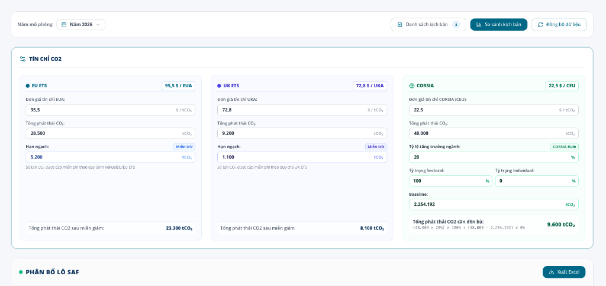
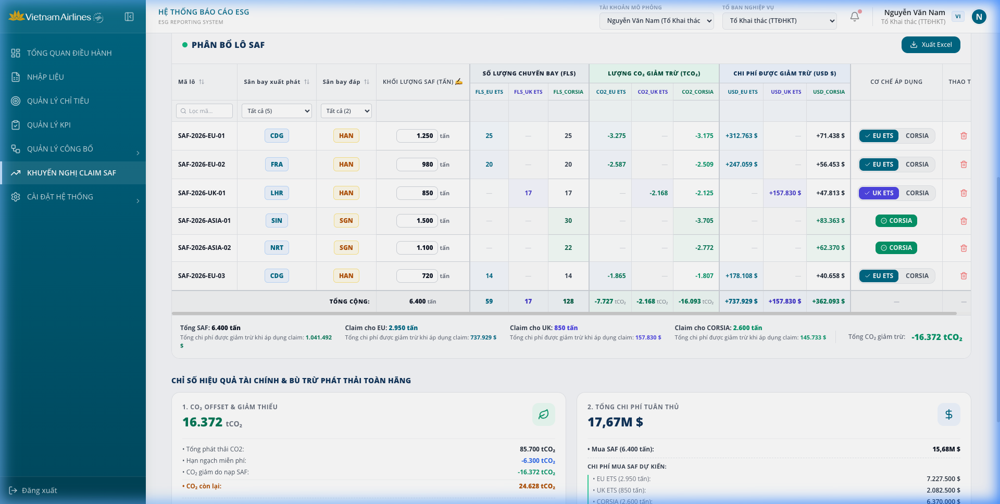
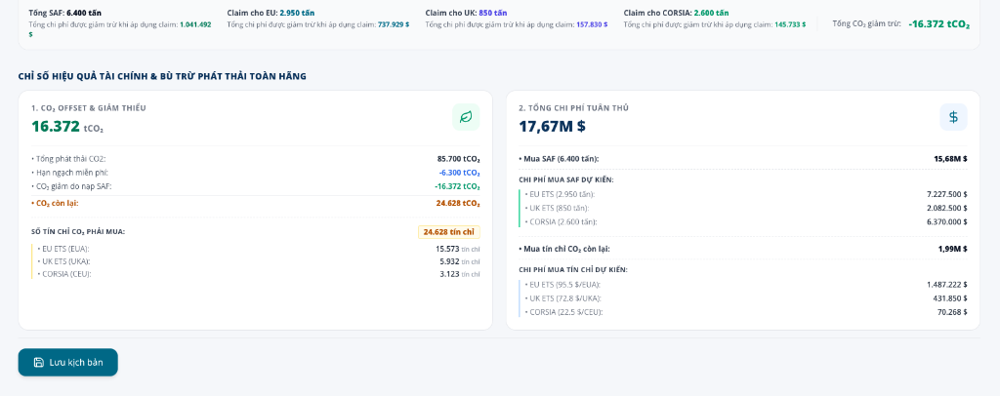
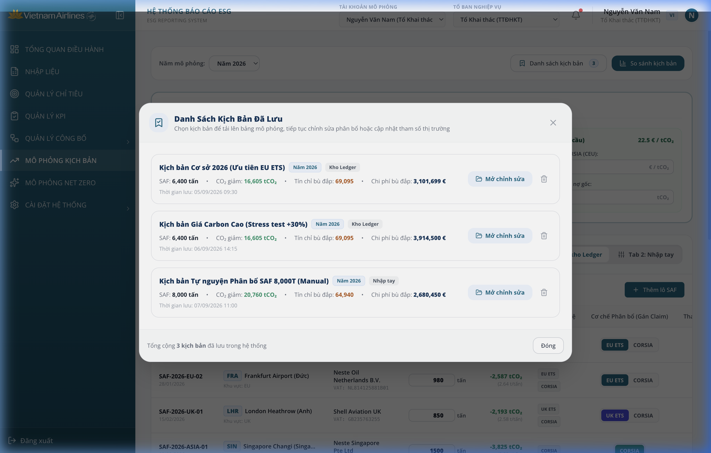
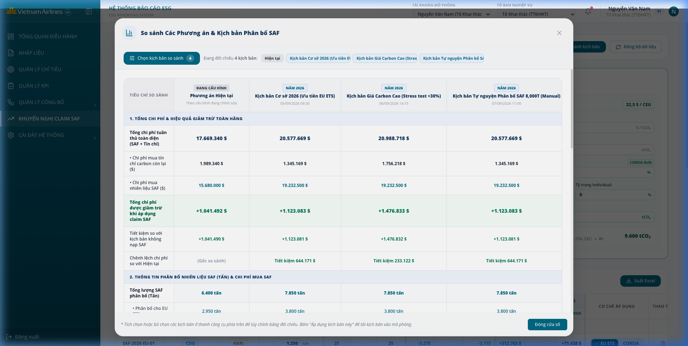
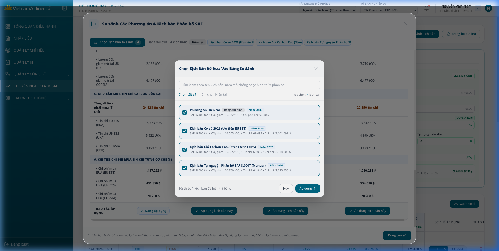

# TÀI LIỆU MÔ TẢ YÊU CẦU / THAY ĐỔI NÂNG CẤP
**Mã hiệu dự án:** VNA-ESG-2026 (Hệ thống Quản lý & Báo cáo Phát thải NetZero)  
**Mã hiệu tài liệu:** SRS-VNA-SAF-001  
**Ngày:** 21/09/2026  

---

## 1. BẢNG GHI NHẬN THAY ĐỔI

| Ngày thay đổi | Vị trí thay đổi | Thao tác (A/M/D)* | Ticket | Đầu mối | Mô tả thay đổi | Ghi chú |
| --- | --- | --- | --- | --- | --- | --- |
| 21/09/2026 | Mô phỏng NetZero V2 -> Khối Phân bổ Lô SAF | A | VNA-NZ-008 | Ban Chuyển đổi số & ESG (VNA) | Xây dựng tài liệu SRS chuẩn hóa cho chức năng Khuyến nghị claim SAF | Chuyển đổi hiển thị đồng nhất về USD ($) |
| 21/09/2026 | Toàn bộ phân hệ Mô phỏng NetZero V2 | M | VNA-NZ-009 | Ban Chuyển đổi số & ESG (VNA) | Bổ sung đặc tả chi tiết 2 vùng thông tin liên kết trực tiếp:<br>1. Vùng Tham số Tín chỉ CO2 & Nghĩa vụ phát thải (EU ETS, UK ETS, CORSIA).<br>2. Vùng Chỉ số Hiệu quả Tài chính & Bù trừ Phát thải Toàn hãng (KPIs: CO2 Offset & Tổng Chi phí Tuân thủ) kèm Thao tác Lưu kịch bản. | Hoàn thiện trọn vẹn luồng tương tác 3 vùng |
| 21/09/2026 | Mô phỏng NetZero V2 -> Popups Chức năng | A | VNA-NZ-010 | Ban Chuyển đổi số & ESG (VNA) | Bổ sung đặc tả chi tiết 2 màn hình Popup của các button chức năng:<br>1. Popup Danh sách kịch bản đã lưu (Scenario List Modal).<br>2. Popup So sánh kịch bản đa chiều (Scenario Comparison Modal & Picker). | Đầy đủ UI, Data model, Luồng logic và Button actions cho Dev |

*(A - Tạo mới, M - Sửa đổi, D - Xóa bỏ)*

---

## 2. TRANG KÝ

- **Người lập:** Business Analyst Team - Synodus / Vietnam Airlines - 21/09/2026
- **Người xem xét 1:** Solution Architect - 21/09/2026
- **Người xem xét 2:** Product Owner ESG (Ban Kế hoạch Phát triển & Tổ Khai thác) - 21/09/2026
- **Người phê duyệt:** Project Manager - 21/09/2026

---

## 3. TỔNG QUAN

### 3.1 VẤN ĐỀ HIỆN TẠI
- **Reporter:** Tổ Khai thác bay & Ban Kế hoạch Phát triển - Vietnam Airlines.
- **Giải trình vấn đề:**
  1. **Nhiều cơ chế tuân thủ phát thải cùng lúc:** Hãng hàng không quốc gia Vietnam Airlines (VNA) hiện đang chịu sự điều chỉnh đồng thời của 3 cơ chế tuân thủ phát thải carbon quốc tế và khu vực với các quy định pháp lý và cấu trúc chi phí khác biệt lớn:
     - **EU ETS (European Union Emissions Trading System):** Áp dụng cho các chặng bay nội khối Châu Âu và khởi hành từ/đến sân bay thuộc khối EU. Đơn giá tín chỉ EUA rất cao (~95,5 USD/tCO₂). Được hưởng hạn ngạch miễn trừ (Free Allowance) theo quy định ReFuelEU/EU ETS.
     - **UK ETS (United Kingdom Emissions Trading System):** Áp dụng cho các chuyến bay liên quan đến Vương quốc Anh. Đơn giá tín chỉ UKA dao động ~72,8 USD/tCO₂. Được hưởng hạn ngạch miễn trừ theo quy chế UK ETS.
     - **CORSIA (Carbon Offsetting and Reduction Scheme for International Aviation):** Áp dụng cho các chuyến bay quốc tế giữa các quốc gia tham gia theo ICAO. Đơn giá tín chỉ bù trừ CEU hiện tại tương đối thấp (~22,5 USD/tCO₂). Nghĩa vụ đền bù được tính toán phức tạp dựa trên: Tỷ lệ tăng trưởng ngành (Growth Rate), Tỷ trọng Sectoral / Individual, và Baseline phát thải chuẩn.
  2. **Chi phí SAF đắt đỏ và bài toán tối ưu hóa:** Nhiên liệu hàng không bền vững (SAF) có giá thành cao gấp 2–4 lần so với nhiên liệu phản lực hóa thạch thông thường (Jet A-1). Tuy nhiên, khi sử dụng SAF, hãng được quyền khai báo (**Claim SAF**) để khấu trừ vào nghĩa vụ phát thải phải mua tín chỉ.
  3. **Rủi ro phân bổ sai lệch và thiếu tính liên kết toàn diện:** Mỗi lô SAF nạp tại các sân bay khác nhau (CDG, LHR, FRA, SIN, NRT, SGN, HAN) có tính pháp lý và chứng chỉ hợp lệ (Eligible Schemes) khác nhau. Trước đây:
     - Thiếu công cụ mô phỏng liên hoàn từ **Tham số thị trường & Nghĩa vụ gốc** -> **Phân bổ Lô SAF & Khuyến nghị Claim** -> **Chỉ số Hiệu quả Tài chính & Bù trừ Phát thải Toàn hãng**.
     - Rất dễ xảy ra tình trạng "claim nhầm" một lô SAF hợp lệ cho EU ETS sang cho cơ chế CORSIA, dẫn tới khoản chi phí được giảm trừ chỉ đạt 22,5 USD/tCO₂ thay vì 95,5 USD/tCO₂ (thất thoát giá trị giảm trừ lên tới hơn 75%).
     - Thiếu bức tranh tổng thể về: Số tín chỉ CO₂ còn lại phải mua đền bù sau khi đã trừ hạn ngạch và trừ SAF, cũng như tổng ngân sách tuân thủ ròng (gồm chi phí mua SAF + chi phí mua tín chỉ).

### 3.2 GIẢI PHÁP ĐỀ XUẤT
Xây dựng giải pháp tổng thể trên giao diện **Mô phỏng NetZero V2 (`NetZeroV2.tsx`)** tích hợp chặt chẽ 3 vùng thông tin liên hoàn:

1. **VÙNG 1: THIẾT LẬP THAM SỐ THỊ TRƯỜNG & NGHĨA VỤ PHÁT THẢI (TÍN CHỈ CO2):**
   - Cho phép người dùng cấu hình đơn giá tín chỉ (EUA, UKA, CEU), tổng phát thải gộp, hạn ngạch miễn trừ (EU, UK) và các tham số CORSIA (Tỷ lệ tăng trưởng ngành, Tỷ trọng Sectoral / Individual, Baseline).
   - Tự động tính toán phát thải sau miễn giảm cho EU ETS, UK ETS và phát thải cần đền bù theo quy định CORSIA.
2. **VÙNG TRUNG TÂM: BẢNG PHÂN BỔ LÔ SAF & KHUYẾN NGHỊ CLAIM TỐI ƯU:**
   - Quản lý chi tiết từng lô SAF (Mã lô, Sân bay đi/đến, Khối lượng tấn SAF cho phép chỉnh sửa trực tiếp).
   - Tự động tính toán ma trận đa cơ chế: Số chuyến bay (FLS), Khối lượng CO₂ giảm trừ (tCO₂), và Chi phí tuân thủ được khấu trừ (USD $).
   - Tự động gợi ý cơ chế có giá trị giảm trừ cao nhất (Ưu tiên EU ETS > UK ETS > CORSIA) và cung cấp nút chuyển đổi cơ chế linh hoạt.
   - Khối tóm tắt ma trận (Summary Matrix Footer): Tổng SAF, chi tiết phân bổ và tổng chi phí giảm trừ theo từng cơ chế.
3. **VÙNG 2: CHỈ SỐ HIỆU QUẢ TÀI CHÍNH & BÙ TRỪ PHÁT THẢI TOÀN HÃNG (KPIS) & QUẢN TRỊ KỊCH BẢN:**
   - **Thẻ 1: 1. CO₂ Offset & Giảm thiểu:** Tổng hợp phát thải toàn hãng, hạn ngạch miễn phí, CO₂ giảm do SAF, CO₂ còn lại và phân rã số lượng tín chỉ CO₂ phải mua cho từng cơ chế (EU ETS, UK ETS, CORSIA).
   - **Thẻ 2: 2. Tổng Chi phí Tuân thủ:** Tổng ngân sách tuân thủ (M $), phân rã chi phí mua SAF theo từng cơ chế và chi phí mua tín chỉ còn lại theo từng cơ chế.
   - **Thao tác kịch bản:** Hỗ trợ Lưu kịch bản, Xem danh sách kịch bản, So sánh kịch bản, Đồng bộ dữ liệu và Chọn năm mô phỏng.

### 3.3 CÁC THUẬT NGỮ SỬ DỤNG TRONG TÀI LIỆU

| STT | THUẬT NGỮ | GIẢI THÍCH |
| --- | --- | --- |
| 1 | **SAF** | Sustainable Aviation Fuel - Nhiên liệu hàng không bền vững, giảm tới 70–80% phát thải vòng đời so với Jet A-1. |
| 2 | **Claim SAF** | Quy trình khai báo khối lượng SAF đã nạp/sử dụng với cơ quan thẩm quyền để được khấu trừ trực tiếp vào nghĩa vụ phát thải. |
| 3 | **EU ETS & EUA** | European Union Emissions Trading System & European Union Allowance - Hệ thống giao dịch phát thải và đơn vị tín chỉ của Liên minh Châu Âu (đơn vị: EUA, 1 EUA = 1 tCO₂). |
| 4 | **UK ETS & UKA** | United Kingdom Emissions Trading System & United Kingdom Allowance - Hệ thống giao dịch phát thải và đơn vị tín chỉ của Vương quốc Anh (đơn vị: UKA, 1 UKA = 1 tCO₂). |
| 5 | **CORSIA & CEU** | Carbon Offsetting and Reduction Scheme for International Aviation & CORSIA Eligible Unit - Kế hoạch bù trừ và đơn vị tín chỉ của ICAO (đơn vị: CEU, 1 CEU = 1 tCO₂). |
| 6 | **Free Allowance** | Hạn ngạch phát thải được cơ quan quản lý cấp miễn phí cho hãng hàng không theo quy định ReFuelEU/EU ETS và UK ETS. |
| 7 | **Baseline CORSIA** | Mức phát thải cơ sở lịch sử (giai đoạn 2019–2020) dùng làm căn cứ tính toán nghĩa vụ đền bù tăng trưởng của hãng. |
| 8 | **FLS** | Flight Leg Status / Flights - Số lượng chặng bay / chuyến bay được ghi nhận nạp hoặc thụ hưởng từ lô SAF. |
| 9 | **Eligible Schemes** | Các cơ chế thị trường mà lô SAF đáp ứng đủ chứng chỉ chuỗi hành trình (Chain of Custody) và quy định pháp lý để claim. |
| 10 | **Assigned Scheme** | Cơ chế thị trường được hệ thống khuyến nghị hoặc người dùng lựa chọn để thực hiện claim cho lô SAF đó. |
| 11 | **Total Reduced Cost** | Tổng chi phí được giảm trừ: Số tiền (USD) tiết kiệm được từ nghĩa vụ mua tín chỉ nhờ việc áp dụng claim SAF. |
| 12 | **Net Compliance Cost** | Tổng chi phí tuân thủ ròng = Chi phí mua SAF + Chi phí mua tín chỉ CO₂ còn lại. |

### 3.4 SƠ ĐỒ TỔNG QUAN CHỨC NĂNG

Sơ đồ quy trình nghiệp vụ tổng quan liên hoàn giữa 3 vùng thông tin (Business Flow Diagram):

```xml
<mxGraphModel dx="1422" dy="800" grid="1" gridSize="10" guides="1" tooltips="1" connect="1" arrows="1" fold="1" page="1" pageScale="1" pageWidth="1169" pageHeight="827" background="#ffffff">
  <root>
    <mxCell id="0"/>
    <mxCell id="1" parent="0"/>
    
    <!-- VÙNG 1: THIẾT LẬP THAM SỐ THỊ TRƯỜNG -->
    <mxCell id="start" value="Bắt đầu: Thiết lập Tham số Thị trường&#xa;&amp; Nghĩa vụ Tín chỉ CO₂&#xa;(EU ETS, UK ETS, CORSIA)" style="rounded=1;whiteSpace=wrap;html=1;fillColor=#d5e8d4;strokeColor=#82b1ff;fontStyle=1;fontSize=11;" vertex="1" parent="1">
      <mxGeometry x="50" y="80" width="190" height="70" as="geometry"/>
    </mxCell>

    <mxCell id="p1" value="Tính toán Nghĩa vụ phát thải:&#xa;• EU: Max(0, Gross - Miễn trừ)&#xa;• UK: Max(0, Gross - Miễn trừ)&#xa;• CORSIA: (Gross × Growth) × Sec + ... " style="rounded=1;whiteSpace=wrap;html=1;fillColor=#dae8fc;strokeColor=#6c8ebf;fontSize=11;" vertex="1" parent="1">
      <mxGeometry x="280" y="75" width="220" height="80" as="geometry"/>
    </mxCell>
    <mxCell id="e1" style="edgeStyle=orthogonalEdgeStyle;rounded=0;orthogonalLoop=1;jettySize=auto;html=1;strokeWidth=2;strokeColor=#00556e;" edge="1" parent="1" source="start" target="p1">
      <mxGeometry relative="1" as="geometry"/>
    </mxCell>

    <!-- VÙNG TRUNG TÂM: PHÂN BỔ LÔ SAF -->
    <mxCell id="p2" value="Bảng Phân bổ Lô SAF:&#xa;• Xác định Eligible Schemes&#xa;• Tính ma trận: FLS, CO₂, USD&#xa;• Đề xuất cơ chế tối ưu (EU > UK > CORSIA)" style="rounded=1;whiteSpace=wrap;html=1;fillColor=#e1d5e7;strokeColor=#9673a6;fontSize=11;" vertex="1" parent="1">
      <mxGeometry x="540" y="75" width="220" height="80" as="geometry"/>
    </mxCell>
    <mxCell id="e2" style="edgeStyle=orthogonalEdgeStyle;rounded=0;orthogonalLoop=1;jettySize=auto;html=1;strokeWidth=2;strokeColor=#00556e;" edge="1" parent="1" source="p1" target="p2">
      <mxGeometry relative="1" as="geometry"/>
    </mxCell>

    <mxCell id="d1" value="Người dùng&#xa;điều chỉnh?" style="rhombus;whiteSpace=wrap;html=1;fillColor=#fff2cc;strokeColor=#d6b656;fontStyle=1;fontSize=11;" vertex="1" parent="1">
      <mxGeometry x="800" y="75" width="120" height="80" as="geometry"/>
    </mxCell>
    <mxCell id="e3" style="edgeStyle=orthogonalEdgeStyle;rounded=0;orthogonalLoop=1;jettySize=auto;html=1;strokeWidth=2;strokeColor=#00556e;" edge="1" parent="1" source="p2" target="d1">
      <mxGeometry relative="1" as="geometry"/>
    </mxCell>

    <mxCell id="p3" value="Thao tác: Sửa tấn SAF,&#xa;Chuyển đổi cơ chế áp dụng,&#xa;Lọc theo cột, Sắp xếp, Xuất Excel" style="rounded=1;whiteSpace=wrap;html=1;fillColor=#ffe6cc;strokeColor=#d79b00;fontSize=11;" vertex="1" parent="1">
      <mxGeometry x="760" y="200" width="200" height="70" as="geometry"/>
    </mxCell>
    <mxCell id="e4" value="Có" style="edgeStyle=orthogonalEdgeStyle;rounded=0;orthogonalLoop=1;jettySize=auto;html=1;strokeWidth=2;strokeColor=#00556e;" edge="1" parent="1" source="d1" target="p3">
      <mxGeometry relative="1" as="geometry"/>
    </mxCell>

    <!-- VÙNG 2: CHỈ SỐ HIỆU QUẢ TÀI CHÍNH & BÙ TRỪ TOÀN HÃNG -->
    <mxCell id="p4" value="Vùng Chỉ số Hiệu quả Toàn Hãng (KPIs):&#xa;1. CO₂ Offset &amp; Tín chỉ CO₂ phải mua&#xa;2. Tổng Chi phí Tuân thủ (Mua SAF + Mua tín chỉ)" style="rounded=1;whiteSpace=wrap;html=1;fillColor=#d5e8d4;strokeColor=#82b1ff;fontStyle=1;fontSize=11;" vertex="1" parent="1">
      <mxGeometry x="480" y="200" width="240" height="70" as="geometry"/>
    </mxCell>
    <mxCell id="e5" value="Không" style="edgeStyle=orthogonalEdgeStyle;rounded=0;orthogonalLoop=1;jettySize=auto;html=1;strokeWidth=2;strokeColor=#00556e;" edge="1" parent="1" source="d1" target="p4">
      <mxGeometry relative="1" as="geometry">
        <Array as="points">
          <mxPoint x="860" y="170"/>
          <mxPoint x="600" y="170"/>
        </Array>
      </mxGeometry>
    </mxCell>
    <mxCell id="e6" style="edgeStyle=orthogonalEdgeStyle;rounded=0;orthogonalLoop=1;jettySize=auto;html=1;strokeWidth=2;strokeColor=#00556e;" edge="1" parent="1" source="p3" target="p4">
      <mxGeometry relative="1" as="geometry"/>
    </mxCell>

    <mxCell id="p5" value="Quản trị kịch bản:&#xa;• Lưu kịch bản mô phỏng&#xa;• So sánh kịch bản đa chiều&#xa;• Đồng bộ dữ liệu phát thải" style="rounded=1;whiteSpace=wrap;html=1;fillColor=#dae8fc;strokeColor=#6c8ebf;fontSize=11;" vertex="1" parent="1">
      <mxGeometry x="240" y="200" width="200" height="70" as="geometry"/>
    </mxCell>
    <mxCell id="e7" style="edgeStyle=orthogonalEdgeStyle;rounded=0;orthogonalLoop=1;jettySize=auto;html=1;strokeWidth=2;strokeColor=#00556e;" edge="1" parent="1" source="p4" target="p5">
      <mxGeometry relative="1" as="geometry"/>
    </mxCell>

    <mxCell id="end" value="Kết thúc: Sẵn sàng báo cáo MRV&#xa;&amp; Lập kế hoạch ngân sách" style="ellipse;whiteSpace=wrap;html=1;fillColor=#d5e8d4;strokeColor=#82b1ff;fontStyle=1;fontSize=11;" vertex="1" parent="1">
      <mxGeometry x="50" y="200" width="150" height="70" as="geometry"/>
    </mxCell>
    <mxCell id="e8" style="edgeStyle=orthogonalEdgeStyle;rounded=0;orthogonalLoop=1;jettySize=auto;html=1;strokeWidth=2;strokeColor=#00556e;" edge="1" parent="1" source="p5" target="end">
      <mxGeometry relative="1" as="geometry"/>
    </mxCell>
  </root>
</mxGraphModel>
```

---

## 4. MONG MUỐN

### 4.1 IN SCOPE (USER STORIES)

| STT | USER STORY | MÔ TẢ | ƯU TIÊN | GHI CHÚ |
| --- | --- | --- | --- | --- |
| 1 | **Thiết lập tham số thị trường (EU, UK, CORSIA)** | Là Chuyên viên ESG, tôi muốn nhập và điều chỉnh đơn giá tín chỉ (EUA, UKA, CEU), tổng phát thải CO₂ và hạn ngạch miễn trừ để phản ánh chính xác các điều kiện thị trường hiện tại. | High | Vùng 1: Tín chỉ CO₂. Đơn vị đồng nhất là USD ($). |
| 2 | **Cấu hình tham số quy định CORSIA** | Là Chuyên viên phân tích, tôi muốn nhập Tỷ lệ tăng trưởng ngành (%), Tỷ trọng Sectoral / Individual (%) và Baseline phát thải để hệ thống tự động tính ra tổng phát thải CO₂ cần đền bù theo đúng công thức ICAO. | High | Vùng 1: CORSIA Card. Hiển thị công thức trực quan. |
| 3 | **Xem danh sách và ma trận so sánh Lô SAF** | Là Chuyên viên ESG, tôi muốn xem danh sách các lô SAF kèm số chuyến bay (FLS), lượng CO₂ giảm trừ và số tiền chi phí giảm trừ (USD) song song cho cả 3 cơ chế. | High | Vùng Trung tâm: Bảng Phân bổ Lô SAF. |
| 4 | **Khuyến nghị & Chuyển đổi cơ chế claim** | Là Chuyên viên ESG, tôi muốn hệ thống tự động khuyến nghị cơ chế tối ưu nhất (giảm trừ USD cao nhất) và cho phép tôi chuyển đổi linh hoạt cơ chế áp dụng chỉ bằng 1 cú nhấp chuột. | High | Vùng Trung tâm: Cột Cơ chế áp dụng. |
| 5 | **Chỉnh sửa khối lượng SAF trực tiếp** | Là Chuyên viên phân tích NetZero, tôi muốn có thể chỉnh sửa trực tiếp số tấn SAF của từng lô ngay trên bảng để mô phỏng biến động nguồn cung. | Medium | Bảng tự động tính toán lại toàn bộ FLS, CO₂ và USD tức thì. |
| 6 | **Lọc và sắp xếp theo cột** | Là Người dùng, tôi muốn lọc theo Mã lô, Sân bay đi, Sân bay đến và sắp xếp tăng/giảm trên từng cột để tra cứu nhanh. | Medium | Có nút "Đặt lại lọc" khi có điều kiện lọc đang áp dụng. |
| 7 | **Xuất báo cáo Excel** | Là Chuyên viên ESG, tôi muốn tải bảng phân bổ lô SAF ra file `.xlsx` đầy đủ dữ liệu để gửi hồ sơ thẩm tra phát thải MRV. | High | Nút "Xuất Excel" ở góc phải bảng. |
| 8 | **Xem Chỉ số CO₂ Offset & Giảm thiểu toàn hãng** | Là Lãnh đạo/Chuyên viên, tôi muốn nhìn thấy tổng khối lượng phát thải toàn hãng, hạn ngạch miễn trừ, CO₂ giảm do SAF, CO₂ còn lại và phân rã số tín chỉ phải mua chi tiết theo EU ETS, UK ETS, CORSIA. | High | Vùng 2: Thẻ KPI 1. |
| 9 | **Xem Chỉ số Tổng Chi phí Tuân thủ toàn hãng** | Là Ban Giám đốc/Kế toán trưởng, tôi muốn nắm bắt tổng ngân sách tuân thủ (M $), phân rã chi phí mua SAF theo từng cơ chế và chi phí mua tín chỉ CO₂ còn lại theo từng cơ chế. | High | Vùng 2: Thẻ KPI 2. |
| 10 | **Quản trị kịch bản mô phỏng** | Là Chuyên viên phân tích, tôi muốn có nút "Lưu kịch bản", "So sánh kịch bản", "Danh sách kịch bản", và "Đồng bộ dữ liệu" để so sánh hiệu quả kinh tế giữa các phương án. | High | Nút Lưu kịch bản ở chân trang và Thanh công cụ phía trên. |

### 4.2 OUT OF SCOPE (Những phần chưa làm ngay)

| STT | USER STORY | LÝ DO |
| --- | --- | --- |
| 1 | **Tự động đồng bộ hóa thời gian thực với SAP/ERP về hóa đơn mua SAF và giá giao dịch tín chỉ** | Giai đoạn hiện tại dữ liệu được nhập định kỳ qua giao diện mô phỏng hoặc đồng bộ từ Ledger; kết nối API real-time với hệ thống ERP lõi sẽ thực hiện ở giai đoạn sau. |
| 2 | **Tự động nộp trực tuyến hồ sơ Claim sang cổng của Cơ quan Hàng không EU/UK/ICAO** | Quy định hiện hành của các cơ quan quản lý bắt buộc phải qua khâu thẩm định của đơn vị kiểm toán độc lập bên thứ ba (Third-party Verification Body) và nộp có ký duyệt số thủ công. |

---

## 5. MÔ TẢ CHI TIẾT CHỨC NĂNG

### 5.1 VÙNG 1: THIẾT LẬP THAM SỐ THỊ TRƯỜNG & NGHĨA VỤ TÍN CHỈ CO2 (TÍN CHỈ CO2)

**Thông tin chung:**  
Cho phép người dùng quản lý và điều chỉnh các biến số đầu vào then chốt của thị trường carbon (đơn giá tín chỉ, tổng phát thải phát sinh, hạn ngạch miễn trừ và các quy tắc đặc thù của ICAO CORSIA) để làm cơ sở tính toán nghĩa vụ bù trừ gốc cho toàn hãng.

**Truy cập:** Khối đầu tiên trên trang `Mô phỏng NetZero V2` (`/#/netzero-simulation-v2`).

**Màn hình chức năng:**



*Hình 5.1: Giao diện Thanh công cụ và Khối Tham số Tín chỉ CO₂ (EU ETS, UK ETS, CORSIA)*

---

**Mô tả thành phần giao diện Vùng 1:**

| STT | Tên | Loại control | Bắt buộc | Độ dài tối đa | Readonly | Mô tả |
| --- | --- | --- | --- | --- | --- | --- |
| 1 | **Năm mô phỏng** | YearPicker Combobox | x | 4 ký tự | Edit | Lựa chọn năm lập kịch bản mô phỏng (vd: `Năm 2026`). |
| 2 | **Danh sách kịch bản** | Button (with Badge) | - | - | Action | Mở modal danh sách các kịch bản đã lưu kèm số lượng kịch bản hiện có (vd: `3`). |
| 3 | **So sánh kịch bản** | Button | - | - | Action | Mở modal so sánh đa chiều giữa kịch bản hiện tại và các kịch bản đã lưu. |
| 4 | **Đồng bộ dữ liệu** | Button | - | - | Action | Kích hoạt lấy dữ liệu phát thải mới nhất từ hệ thống giám sát bay (OCC/Flight Data). |
| 5 | **Badge Đơn giá EU ETS** | Badge Label | x | - | Readonly | Hiển thị tóm tắt đơn giá: `95,5 $ / EUA`. |
| 6 | **Đơn giá tín chỉ EUA** | FormattedNumberInput | x | 10 ký tự | Edit | Nhập đơn giá thị trường của 1 tín chỉ EU ETS ($/tCO₂). Hỗ trợ số thập phân. |
| 7 | **Tổng phát thải CO₂ (EU ETS)** | FormattedNumberInput | x | 15 ký tự | Edit | Tổng phát thải CO₂ phát sinh trên các chặng bay thuộc khối EU (tCO₂). |
| 8 | **Hạn ngạch miễn trừ (EU ETS)** | FormattedNumberInput | x | 15 ký tự | Edit | Số tấn CO₂ được cấp miễn phí theo quy định ReFuelEU/EU ETS (tCO₂). Có badge `Miễn trừ`. |
| 9 | **Tổng phát thải CO₂ sau miễn giảm (EU)** | Text Label | x | - | Readonly | Kết quả tính toán: $\max(0, 	ext{Phát thải} - 	ext{Hạn ngạch})$ (vd: `23.300 tCO₂`). |
| 10 | **Badge Đơn giá UK ETS** | Badge Label | x | - | Readonly | Hiển thị tóm tắt đơn giá: `72,8 $ / UKA`. |
| 11 | **Đơn giá tín chỉ UKA** | FormattedNumberInput | x | 10 ký tự | Edit | Nhập đơn giá thị trường của 1 tín chỉ UK ETS ($/tCO₂). Hỗ trợ số thập phân. |
| 12 | **Tổng phát thải CO₂ (UK ETS)** | FormattedNumberInput | x | 15 ký tự | Edit | Tổng phát thải CO₂ phát sinh trên các chặng bay liên quan đến Vương quốc Anh (tCO₂). |
| 13 | **Hạn ngạch miễn trừ (UK ETS)** | FormattedNumberInput | x | 15 ký tự | Edit | Số tấn CO₂ được cấp miễn phí theo quy chế UK ETS (tCO₂). Có badge `Miễn trừ`. |
| 14 | **Tổng phát thải CO₂ sau miễn giảm (UK)** | Text Label | x | - | Readonly | Kết quả tính toán: $\max(0, 	ext{Phát thải} - 	ext{Hạn ngạch})$ (vd: `8.100 tCO₂`). |
| 15 | **Badge Đơn giá CORSIA** | Badge Label | x | - | Readonly | Hiển thị tóm tắt đơn giá: `22,5 $ / CEU`. |
| 16 | **Đơn giá tín chỉ CORSIA (CEU)** | FormattedNumberInput | x | 10 ký tự | Edit | Nhập đơn giá thị trường của 1 tín chỉ CORSIA ($/tCO₂). Hỗ trợ số thập phân. |
| 17 | **Tổng phát thải CO₂ (CORSIA)** | FormattedNumberInput | x | 15 ký tự | Edit | Tổng phát thải CO₂ phát sinh trên các chặng bay quốc tế thuộc phạm vi CORSIA (tCO₂). |
| 18 | **Tỷ lệ tăng trưởng ngành** | FormattedNumberInput | x | 5 ký tự | Edit | Tỷ lệ % tăng trưởng phát thải ngành hàng không quốc tế theo ICAO (vd: `20 %`). Có badge `CORSIA Rule`. |
| 19 | **Tỷ trọng Sectoral** | FormattedNumberInput | x | 5 ký tự | Edit | Tỷ trọng áp dụng tăng trưởng toàn ngành (%) (Mặc định `100 %`). |
| 20 | **Tỷ trọng Individual** | FormattedNumberInput | x | 5 ký tự | Edit | Tỷ trọng áp dụng tăng trưởng riêng của hãng (%) (Mặc định `0 %`). |
| 21 | **Baseline phát thải (CORSIA)** | FormattedNumberInput | x | 15 ký tự | Edit | Mức phát thải cơ sở lịch sử của VNA (vd: `2.254.192 tCO₂`). |
| 22 | **Tổng phát thải CO₂ cần đền bù (CORSIA)** | Text Label & Formula | x | - | Readonly | Hiển thị công thức diễn giải và kết quả tính toán nghĩa vụ đền bù CORSIA (vd: `9.600 tCO₂`). |

---

**Luồng xử lý logic Vùng 1:**

1. **Công thức tính Nghĩa vụ phát thải sau miễn giảm EU ETS:**
   $$	ext{Obligation}_{	ext{EU\_net}} = \max(0, 	ext{Obligation}_{	ext{EU}} - 	ext{FreeAllowance}_{	ext{EU}})$$
   *Ví dụ thực tế:* $	ext{Obligation}_{	ext{EU\_net}} = 28.500 - 5.200 = 23.300	ext{ tCO}_2$.

2. **Công thức tính Nghĩa vụ phát thải sau miễn giảm UK ETS:**
   $$	ext{Obligation}_{	ext{UK\_net}} = \max(0, 	ext{Obligation}_{	ext{UK}} - 	ext{FreeAllowance}_{	ext{UK}})$$
   *Ví dụ thực tế:* $	ext{Obligation}_{	ext{UK\_net}} = 9.200 - 1.100 = 8.100	ext{ tCO}_2$.

3. **Công thức tính Nghĩa vụ đền bù CORSIA theo quy tắc ICAO:**
   $$	ext{SectoralComp} = (	ext{Obligation}_{	ext{CORSIA}} 	imes 	ext{GrowthRate}) 	imes 	ext{SectoralWeight}$$
   $$	ext{IndividualComp} = \max(0, 	ext{Obligation}_{	ext{CORSIA}} - 	ext{Baseline}) 	imes 	ext{IndividualWeight}$$
   $$	ext{Obligation}_{	ext{CORSIA\_net}} = \max(0, 	ext{Round}(	ext{SectoralComp} + 	ext{IndividualComp}))$$
   *Ví dụ thực tế:* $(48.000 	imes 20\%) 	imes 100\% + (48.000 - 2.254.192) 	imes 0\% = 9.600 + 0 = 9.600	ext{ tCO}_2$.

4. **Tự động kích hoạt tính toán lại:** Khi bất kỳ giá trị nào trong 3 thẻ thay đổi, toàn bộ các bảng tính ở Vùng Trung tâm (Bảng Phân bổ Lô SAF) và Vùng 2 (Chỉ số Hiệu quả Tài chính) đều được tự động re-calculate theo thời gian thực (reactive state).

---

### 5.2 VÙNG TRUNG TÂM: BẢNG PHÂN BỔ LÔ SAF & KHUYẾN NGHỊ CLAIM TỐI ƯU

**Thông tin chung:**  
Quản trị danh sách các lô SAF tiếp nhận, tính toán ma trận FLS, CO₂, USD song song cho cả 3 cơ chế và tự động đưa ra khuyến nghị phân bổ cơ chế tối ưu nhằm đem lại giá trị khấu trừ cao nhất.

**Truy cập:** Khối `PHÂN BỔ LÔ SAF` trên trang `Mô phỏng NetZero V2`.

**Màn hình chức năng:**



*Hình 5.2: Giao diện Bảng Phân bổ Lô SAF và Khối Tóm tắt Ma trận (Summary Matrix Footer)*

---

**Mô tả thành phần giao diện Vùng Trung tâm:**

| STT | Tên | Loại control | Bắt buộc | Độ dài tối đa | Readonly | Mô tả |
| --- | --- | --- | --- | --- | --- | --- |
| 1 | **Tiêu đề phân hệ** | Text Label | x | - | Readonly | Hiển thị "PHÂN BỔ LÔ SAF" kèm chấm xanh pulse trạng thái hoạt động. |
| 2 | **Nút Đặt lại lọc** | Button | - | - | Action | Hiển thị khi có bộ lọc hoạt động. Cho phép reset toàn bộ tiêu chí lọc và sắp xếp về mặc định. |
| 3 | **Nút Xuất Excel** | Button | - | - | Action | Tải file Excel chứa đầy đủ danh sách lô SAF, FLS, CO₂, USD chi phí giảm trừ và cơ chế áp dụng. |
| 4 | **Tiêu đề cột kèm Sắp xếp (Sort Header)** | Button / Header | - | - | Action | Các cột: `Mã lô`, `Sân bay xuất phát`, `Sân bay đáp`. Nhấp chuột để chuyển đổi thứ tự Sắp xếp: Không sắp xếp -> Tăng dần -> Giảm dần. |
| 5 | **Ô lọc Mã lô** | Search Input | - | 50 ký tự | Edit | Lọc tìm kiếm tương đối (contains, không phân biệt hoa thường) theo mã lô SAF (vd: `SAF-2026`). Có icon xóa nhanh (X). |
| 6 | **Dropdown lọc Sân bay xuất phát** | Select Combobox | - | - | Edit | Lọc theo mã IATA sân bay xuất phát (Tất cả, CDG, FRA, HAN, LHR, NRT, SGN, SIN,...). |
| 7 | **Dropdown lọc Sân bay đáp** | Select Combobox | - | - | Edit | Lọc theo mã IATA sân bay hạ cánh (Tất cả, HAN, SGN,...). |
| 8 | **Mã lô (Batch No)** | Text Label | x | 30 ký tự | Readonly | Hiển thị mã định danh duy nhất của lô SAF (vd: `SAF-2026-001`). |
| 9 | **Sân bay xuất phát (Origin)** | Badge Label | x | 10 ký tự | Readonly | Hiển thị mã IATA sân bay đi trên nền xanh dương (vd: `CDG`). |
| 10 | **Sân bay đáp (Destination)** | Badge Label | x | 10 ký tự | Readonly | Hiển thị mã IATA sân bay đến trên nền cam hổ phách (vd: `HAN`). |
| 11 | **Khối lượng SAF (Tấn)** | Number Input (Formatted) | x | 10 ký tự | Edit | Cho phép người dùng chỉnh sửa trực tiếp số tấn SAF. Định dạng phân tách phần nghìn. |
| 12 | **Cột FLS_EU ETS, FLS_UK ETS, FLS_CORSIA** | Text / Badge | - | - | Readonly | Hiển thị số chuyến bay tương ứng nếu lô hợp lệ với cơ chế. Nếu không hợp lệ, hiển thị ký hiệu `—`. Dòng được gán sẽ highlight đậm. |
| 13 | **Cột CO2_EU ETS, CO2_UK ETS, CO2_CORSIA** | Number Label | - | - | Readonly | Hiển thị số tấn CO₂ giảm trừ (`-X tCO₂`) tương ứng từng cơ chế. Highlight màu xanh lục đậm nếu cơ chế đó đang được chọn. |
| 14 | **Cột USD_EU ETS, USD_UK ETS, USD_CORSIA** | Currency Label | - | - | Readonly | Hiển thị số tiền chi phí tuân thủ được khấu trừ (`+X $`). Định dạng tiền tệ USD ($). Highlight nổi bật nếu cơ chế đang được chọn. |
| 15 | **Cơ chế áp dụng (Cột thao tác gán)** | Button Group / Badge | x | - | Action/Edit | - Nếu chỉ hợp lệ 1 cơ chế: Hiển thị Badge xanh lục cố định.<br>- Nếu hợp lệ đa cơ chế: Hiển thị bộ nút chuyển đổi (EU ETS / UK ETS / CORSIA). Nút đang chọn có icon tích (`✓`) và nền màu đặc trưng. |
| 16 | **Nút Xóa lô SAF** | Icon Button (Trash2) | - | - | Action | Icon thùng rác màu đỏ, nhấp vào sẽ xóa lô SAF khỏi danh sách mô phỏng hiện tại. |
| 17 | **Dòng Tổng cộng (Table Footer - tfoot)** | Table Row | x | - | Readonly | Hiển thị tổng số tấn SAF, tổng số chuyến bay FLS theo từng cơ chế, tổng CO₂ giảm trừ theo từng cơ chế và tổng USD giảm trừ theo từng cơ chế. |
| 18 | **Khối Tóm tắt Ma trận (Summary Matrix Footer)** | Cards Grid Container | x | - | Readonly | Gồm 5 khối thông tin chính:<br>1. **Tổng SAF**: Tổng số tấn (6.400 tấn) & Tổng chi phí được giảm trừ (1.041.492 $).<br>2. **Claim cho EU**: Số tấn (2.950 tấn) & Chi phí giảm trừ (737.929 $).<br>3. **Claim cho UK**: Số tấn (850 tấn) & Chi phí giảm trừ (157.830 $).<br>4. **Claim cho CORSIA**: Số tấn (2.600 tấn) & Chi phí giảm trừ (145.733 $).<br>5. **Tổng CO₂ giảm trừ**: Khối lượng phát thải ròng giảm được toàn mạng bay (-16.372 tCO₂). |

---

**Luồng xử lý logic Vùng Trung tâm:**

1. **Nhận diện cơ chế hợp lệ (Eligible Schemes):**
   - Chuyến bay xuất phát từ sân bay khối EU (CDG, FRA) -> Hợp lệ: `['EU_ETS', 'CORSIA']`.
   - Chuyến bay xuất phát từ sân bay Anh (LHR) -> Hợp lệ: `['UK_ETS', 'CORSIA']`.
   - Chuyến bay quốc tế khác (SIN, NRT) -> Hợp lệ: `['CORSIA']`.
2. **Tính toán Ma trận FLS, CO₂, USD:**
   - $	ext{CO2}_{EU} = 	ext{Tonnes} 	imes 	ext{co2SavedPerTonne} 	imes 	ext{Factor}_{EU}$
   - $	ext{USD}_{EU} = 	ext{Round}(	ext{CO2}_{EU} 	imes 	ext{Price}_{EU})$ (với $	ext{Price}_{EU} = 95,5	ext{ \$}$)
   - Tương tự tính cho UK ETS ($	ext{Price}_{UK} = 72,8	ext{ \$}$) và CORSIA ($	ext{Price}_{CORSIA} = 22,5	ext{ \$}$).
3. **Khuyến nghị thông minh:**
   - Hệ thống so sánh: $\max(	ext{USD}_{EU}, 	ext{USD}_{UK}, 	ext{USD}_{CORSIA})$.
   - Tự động gán cơ chế có $	ext{USD}$ lớn nhất (thông thường ưu tiên EU ETS > UK ETS > CORSIA) để tối đa hóa số tiền được giảm trừ.
   - Cho phép người dùng chuyển đổi thủ công nếu cần cân đối hạn mức theo chiến lược.

---

### 5.3 VÙNG 2: CHỈ SỐ HIỆU QUẢ TÀI CHÍNH & BÙ TRỪ PHÁT THẢI TOÀN HÃNG (KPIS) & THAO TÁC KỊCH BẢN

**Thông tin chung:**  
Tổng hợp toàn diện bức tranh phát thải và tài chính của kịch bản mô phỏng hiện tại: Khối lượng CO₂ đã giảm, số lượng tín chỉ CO₂ còn lại bắt buộc phải mua trên thị trường, tổng chi phí tuân thủ ròng, và cung cấp tính năng lưu trữ kịch bản.

**Truy cập:** Khối dưới cùng trên trang `Mô phỏng NetZero V2` (`/#/netzero-simulation-v2`).

**Màn hình chức năng:**



*Hình 5.3: Giao diện 2 Thẻ KPI Hiệu quả Tài chính & Bù trừ Phát thải Toàn hãng và Nút Lưu kịch bản*

---

**Mô tả thành phần giao diện Vùng 2:**

| STT | Tên | Loại control | Bắt buộc | Độ dài tối đa | Readonly | Mô tả |
| --- | --- | --- | --- | --- | --- | --- |
| 1 | **Tiêu đề phân vùng** | Text Label | x | - | Readonly | "CHỈ SỐ HIỆU QUẢ TÀI CHÍNH & BÙ TRỪ PHÁT THẢI TOÀN HÃNG". |
| 2 | **Thẻ KPI 1: Tiêu đề & Tổng CO₂ giảm** | Card Container & Label | x | - | Readonly | Tiêu đề "1. CO₂ OFFSET & GIẢM THIỂU", số lớn nổi bật màu xanh lục: `16.372 tCO₂` kèm icon lá cây. |
| 3 | **Tổng phát thải CO₂ (KPI 1)** | Text Label | x | - | Readonly | Tổng phát thải gộp toàn hãng: `85.700 tCO₂` (gồm EU 28.500 + UK 9.200 + CORSIA 48.000). |
| 4 | **Hạn ngạch miễn phí (KPI 1)** | Text Label | x | - | Readonly | Tổng hạn ngạch miễn phí được cấp: `-6.300 tCO₂` (gồm EU 5.200 + UK 1.100). |
| 5 | **CO₂ giảm do nạp SAF (KPI 1)** | Text Label | x | - | Readonly | Tổng lượng CO₂ giảm trừ nhờ claim SAF: `-16.372 tCO₂`. |
| 6 | **CO₂ còn lại (KPI 1)** | Text Label (Highlight) | x | - | Readonly | Khối lượng CO₂ còn lại cần xử lý: `24.628 tCO₂` (Màu cam đậm). |
| 7 | **Khung Số tín chỉ CO₂ phải mua** | Container & Badge | x | - | Readonly | Badge tổng: `24.628 tín chỉ`. Phân rã theo 3 cơ chế:<br>• **EU ETS (EUA):** `15.573 tín chỉ`<br>• **UK ETS (UKA):** `5.932 tín chỉ`<br>• **CORSIA (CEU):** `3.123 tín chỉ`. |
| 8 | **Thẻ KPI 2: Tiêu đề & Tổng Chi phí Tuân thủ** | Card Container & Label | x | - | Readonly | Tiêu đề "2. TỔNG CHI PHÍ TUÂN THỦ", số lớn nổi bật màu xanh navy: `17,67M $` kèm icon `$`. |
| 9 | **Dòng Mua SAF (KPI 2)** | Text Label (Bold) | x | - | Readonly | Chi phí mua SAF tổng cộng: `15,68M $` (cho 6.400 tấn SAF). |
| 10 | **Chi tiết Chi phí mua SAF dự kiến** | Container & List | x | - | Readonly | Phân rã chi phí mua SAF theo từng cơ chế:<br>• **EU ETS (2.950 tấn):** `7.227.500 $`<br>• **UK ETS (850 tấn):** `2.082.500 $`<br>• **CORSIA (2.600 tấn):** `6.370.000 $`. |
| 11 | **Dòng Mua tín chỉ CO₂ còn lại (KPI 2)** | Text Label (Bold) | x | - | Readonly | Chi phí mua các tín chỉ còn thiếu trên thị trường: `1,99M $`. |
| 12 | **Chi tiết Chi phí mua tín chỉ dự kiến** | Container & List | x | - | Readonly | Phân rã chi phí mua tín chỉ theo từng cơ chế:<br>• **EU ETS (95.5 $/EUA):** `1.487.222 $`<br>• **UK ETS (72.8 $/UKA):** `431.850 $`<br>• **CORSIA (22.5 $/CEU):** `70.268 $`. |
| 13 | **Nút Lưu kịch bản** | Button | - | - | Action | Nút bấm màu xanh navy ở góc dưới bên trái, nhấp vào để mở modal đặt tên và lưu kịch bản mô phỏng. |

---

**Luồng xử lý logic Vùng 2:**

1. **Công thức tính toán cho Thẻ KPI 1 (CO₂ Offset & Giảm thiểu):**
   - $	ext{Total Gross Emission} = 	ext{Obligation}_{	ext{EU}} + 	ext{Obligation}_{	ext{UK}} + 	ext{Obligation}_{	ext{CORSIA}} = 28.500 + 9.200 + 48.000 = 85.700	ext{ tCO}_2$.
   - $	ext{Total Free Allowance} = 	ext{Free}_{	ext{EU}} + 	ext{Free}_{	ext{UK}} = 5.200 + 1.100 = 6.300	ext{ tCO}_2$.
   - $	ext{Total CO2 Saved by SAF} = \sum 	ext{CO2}_{	ext{claim}} = 16.372	ext{ tCO}_2$.
   - $	ext{CO2 Remaining} = 	ext{Total Gross} - 	ext{Total Free} - 	ext{Total Saved} = 85.700 - 6.300 - 16.372 = 24.628	ext{ tCO}_2$.
   - **Số tín chỉ CO₂ phải mua theo từng cơ chế:**
     + $	ext{Residual}_{	ext{EU}} = \max(0, 	ext{Obligation}_{	ext{EU\_net}} - 	ext{CO2}_{	ext{SAF\_EU}}) = 23.300 - 7.727 = 15.573	ext{ tín chỉ (EUA)}$.
     + $	ext{Residual}_{	ext{UK}} = \max(0, 	ext{Obligation}_{	ext{UK\_net}} - 	ext{CO2}_{	ext{SAF\_UK}}) = 8.100 - 2.168 = 5.932	ext{ tín chỉ (UKA)}$.
     + $	ext{Residual}_{	ext{CORSIA}} = \max(0, 	ext{Obligation}_{	ext{CORSIA\_net}} - 	ext{CO2}_{	ext{SAF\_CORSIA}}) = 9.600 - 6.477 = 3.123	ext{ tín chỉ (CEU)}$.
     + $	ext{Tổng tín chỉ phải mua} = 15.573 + 5.932 + 3.123 = 24.628	ext{ tín chỉ}$.

2. **Công thức tính toán cho Thẻ KPI 2 (Tổng Chi phí Tuân thủ):**
   - **Chi phí mua SAF dự kiến:**
     + $	ext{Cost}_{	ext{SAF\_EU}} = 2.950	ext{ tấn} 	imes 2.450	ext{ \$/tấn} = 7.227.500	ext{ \$}$.
     + $	ext{Cost}_{	ext{SAF\_UK}} = 850	ext{ tấn} 	imes 2.450	ext{ \$/tấn} = 2.082.500	ext{ \$}$.
     + $	ext{Cost}_{	ext{SAF\_CORSIA}} = 2.600	ext{ tấn} 	imes 2.450	ext{ \$/tấn} = 6.370.000	ext{ \$}$.
     + $	ext{Tổng chi phí mua SAF} = 7.227.500 + 2.082.500 + 6.370.000 = 15.680.000	ext{ \$ (15,68M \$)}$.
   - **Chi phí mua tín chỉ CO₂ còn lại:**
     + $	ext{Cost}_{	ext{Credit\_EU}} = 15.573	ext{ tín chỉ} 	imes 95,5	ext{ \$/EUA} = 1.487.222	ext{ \$}$.
     + $	ext{Cost}_{	ext{Credit\_UK}} = 5.932	ext{ tín chỉ} 	imes 72,8	ext{ \$/UKA} = 431.850	ext{ \$}$.
     + $	ext{Cost}_{	ext{Credit\_CORSIA}} = 3.123	ext{ tín chỉ} 	imes 22,5	ext{ \$/CEU} = 70.268	ext{ \$}$.
     + $	ext{Tổng chi phí mua tín chỉ} = 1.487.222 + 431.850 + 70.268 = 1.989.340	ext{ \$ (1,99M \$)}$.
   - **Tổng Chi phí Tuân thủ ròng:**
     $$	ext{Total Compliance Cost} = 	ext{Tổng chi phí mua SAF} + 	ext{Tổng chi phí mua tín chỉ} = 15.680.000 + 1.989.340 = 17.669.340	ext{ \$ (17,67M \$)}$$

3. **Xử lý Lưu kịch bản (Save Scenario):**
   - Khi nhấn nút "Lưu kịch bản", hệ thống hiển thị modal cho phép nhập tên kịch bản (mặc định gợi ý theo ngày giờ hoặc tên phương án).
   - Khi người dùng xác nhận lưu, toàn bộ dữ liệu gồm: `marketParams` (Vùng 1), `batches` & `assignedScheme` (Vùng Trung tâm), và các chỉ số `executiveKpiMetrics` (Vùng 2) được đóng gói thành 1 bản ghi `NetZeroScenario` và lưu vào `localStorage` (`vna_saved_scenarios_list`).
   - Cập nhật số lượng kịch bản trên Badge của nút "Danh sách kịch bản" ở Header.

---

**Sơ đồ chức năng tổng thể (Swimlane - Horizontal Pool):**

```xml
<mxGraphModel dx="1422" dy="800" grid="1" gridSize="10" guides="1" tooltips="1" connect="1" arrows="1" fold="1" page="1" pageScale="1" pageWidth="1169" pageHeight="827" background="#ffffff">
  <root>
    <mxCell id="0"/>
    <mxCell id="1" parent="0"/>

    <!-- Pool: Khuyến nghị Claim SAF & Mô phỏng Tuân thủ -->
    <mxCell id="pool1" value="Quy trình Tương tác Liên hoàn 3 Vùng (Mô phỏng NetZero V2)" style="swimlane;html=1;childLayout=stackLayout;resizeParent=1;resizeParentMax=0;startSize=20;horizontal=0;horizontalFlip=1;fillColor=#f5f5f5;strokeColor=#666666;fontStyle=1;fontSize=12;" vertex="1" parent="1">
      <mxGeometry x="40" y="40" width="1080" height="520" as="geometry"/>
    </mxCell>

    <!-- Lane 1: Người dùng (Chuyên viên ESG / Lãnh đạo) -->
    <mxCell id="lane_user" value="Chuyên viên ESG / User" style="swimlane;html=1;startSize=20;fillColor=#ffffff;strokeColor=#666666;fontStyle=1;" vertex="1" parent="pool1">
      <mxGeometry x="20" y="0" width="1060" height="170" as="geometry"/>
    </mxCell>
    
    <mxCell id="u_start" value="1. Cấu hình Tham số Vùng 1&#xa;(Giá tín chỉ, Hạn ngạch, CORSIA)" style="rounded=1;whiteSpace=wrap;html=1;fillColor=#dae8fc;strokeColor=#6c8ebf;" vertex="1" parent="lane_user">
      <mxGeometry x="40" y="45" width="180" height="70" as="geometry"/>
    </mxCell>

    <mxCell id="u_action" value="2. Thao tác Vùng Trung tâm:&#xa;• Sửa số tấn SAF của lô&#xa;• Đổi cơ chế claim (Toggle)&#xa;• Lọc/Sắp xếp/Xuất Excel" style="rounded=1;whiteSpace=wrap;html=1;fillColor=#fff2cc;strokeColor=#d6b656;" vertex="1" parent="lane_user">
      <mxGeometry x="370" y="45" width="190" height="70" as="geometry"/>
    </mxCell>

    <mxCell id="u_kpi" value="3. Xem &amp; Đánh giá Vùng 2:&#xa;• CO₂ còn lại &amp; Tín chỉ phải mua&#xa;• Tổng Chi phí Tuân thủ (M $)" style="rounded=1;whiteSpace=wrap;html=1;fillColor=#d5e8d4;strokeColor=#82b1ff;" vertex="1" parent="lane_user">
      <mxGeometry x="670" y="45" width="190" height="70" as="geometry"/>
    </mxCell>

    <mxCell id="u_save" value="4. Nhấn 'Lưu kịch bản' /&#xa;'So sánh kịch bản'" style="rounded=1;whiteSpace=wrap;html=1;fillColor=#ffe6cc;strokeColor=#d79b00;" vertex="1" parent="lane_user">
      <mxGeometry x="900" y="50" width="140" height="60" as="geometry"/>
    </mxCell>

    <!-- Lane 2: Giao diện Web (Frontend UI) -->
    <mxCell id="lane_ui" value="Giao diện (Frontend)" style="swimlane;html=1;startSize=20;fillColor=#ffffff;strokeColor=#666666;fontStyle=1;" vertex="1" parent="pool1">
      <mxGeometry x="20" y="170" width="1060" height="170" as="geometry"/>
    </mxCell>

    <mxCell id="ui_render_v1" value="Hiển thị Vùng 1:&#xa;• 3 Card EU, UK, CORSIA&#xa;• Công thức phát thải sau miễn giảm" style="rounded=1;whiteSpace=wrap;html=1;fillColor=#dae8fc;strokeColor=#6c8ebf;" vertex="1" parent="lane_ui">
      <mxGeometry x="50" y="45" width="160" height="70" as="geometry"/>
    </mxCell>

    <mxCell id="ui_render_center" value="Hiển thị Vùng Trung tâm:&#xa;• Bảng Lô SAF, FLS, CO₂, USD&#xa;• Nút Toggle cơ chế claim&#xa;• Khối Summary Matrix Footer" style="rounded=1;whiteSpace=wrap;html=1;fillColor=#fff2cc;strokeColor=#d6b656;" vertex="1" parent="lane_ui">
      <mxGeometry x="375" y="45" width="180" height="70" as="geometry"/>
    </mxCell>

    <mxCell id="ui_render_v2" value="Hiển thị Vùng 2:&#xa;• Thẻ 1: 16.372 tCO₂ (24.628 còn lại)&#xa;• Thẻ 2: 17,67M $ (Mua SAF + Tín chỉ)&#xa;• Nút Lưu kịch bản" style="rounded=1;whiteSpace=wrap;html=1;fillColor=#d5e8d4;strokeColor=#82b1ff;" vertex="1" parent="lane_ui">
      <mxGeometry x="670" y="45" width="190" height="70" as="geometry"/>
    </mxCell>

    <mxCell id="ui_modal" value="Hiển thị Modal Lưu kịch bản /&#xa;Toast thông báo thành công" style="rounded=1;whiteSpace=wrap;html=1;fillColor=#ffe6cc;strokeColor=#d79b00;" vertex="1" parent="lane_ui">
      <mxGeometry x="895" y="50" width="150" height="60" as="geometry"/>
    </mxCell>

    <!-- Lane 3: Bộ máy tính toán (Engine Logic) -->
    <mxCell id="lane_engine" value="Bộ máy tính toán (Engine)" style="swimlane;html=1;startSize=20;fillColor=#ffffff;strokeColor=#666666;fontStyle=1;" vertex="1" parent="pool1">
      <mxGeometry x="20" y="340" width="1060" height="180" as="geometry"/>
    </mxCell>

    <mxCell id="eng_v1" value="1. Tính nghĩa vụ sau miễn giảm:&#xa;• EU = Gross - Free&#xa;• UK = Gross - Free&#xa;• CORSIA = Sectoral + Individual" style="rounded=1;whiteSpace=wrap;html=1;fillColor=#dae8fc;strokeColor=#6c8ebf;" vertex="1" parent="lane_engine">
      <mxGeometry x="40" y="50" width="180" height="80" as="geometry"/>
    </mxCell>

    <mxCell id="eng_center" value="2. Tính ma trận Lô SAF:&#xa;• CO₂ = Tonnes × Factor&#xa;• USD = CO₂ × Price_scheme&#xa;• Gợi ý Max(USD_EU, UK, CORSIA)" style="rounded=1;whiteSpace=wrap;html=1;fillColor=#fff2cc;strokeColor=#d6b656;" vertex="1" parent="lane_engine">
      <mxGeometry x="370" y="50" width="190" height="80" as="geometry"/>
    </mxCell>

    <mxCell id="eng_v2" value="3. Tính toán Toàn Hãng:&#xa;• Tín chỉ còn lại = Nghĩa vụ - CO2_SAF&#xa;• Chi phí SAF = Tonnes × Đơn giá&#xa;• Chi phí tín chỉ = Tín chỉ × Đơn giá&#xa;• Tổng chi phí = SAF + Tín chỉ" style="rounded=1;whiteSpace=wrap;html=1;fillColor=#d5e8d4;strokeColor=#82b1ff;" vertex="1" parent="lane_engine">
      <mxGeometry x="660" y="45" width="210" height="90" as="geometry"/>
    </mxCell>

    <!-- Edges -->
    <mxCell id="f1" style="edgeStyle=orthogonalEdgeStyle;rounded=0;orthogonalLoop=1;jettySize=auto;html=1;strokeWidth=2;strokeColor=#00556e;" edge="1" parent="pool1" source="u_start" target="eng_v1">
      <mxGeometry relative="1" as="geometry"/>
    </mxCell>
    <mxCell id="f2" style="edgeStyle=orthogonalEdgeStyle;rounded=0;orthogonalLoop=1;jettySize=auto;html=1;strokeWidth=2;strokeColor=#00556e;" edge="1" parent="pool1" source="eng_v1" target="ui_render_v1">
      <mxGeometry relative="1" as="geometry"/>
    </mxCell>
    <mxCell id="f3" style="edgeStyle=orthogonalEdgeStyle;rounded=0;orthogonalLoop=1;jettySize=auto;html=1;strokeWidth=2;strokeColor=#00556e;" edge="1" parent="pool1" source="ui_render_v1" target="u_action">
      <mxGeometry relative="1" as="geometry"/>
    </mxCell>
    <mxCell id="f4" style="edgeStyle=orthogonalEdgeStyle;rounded=0;orthogonalLoop=1;jettySize=auto;html=1;strokeWidth=2;strokeColor=#00556e;" edge="1" parent="pool1" source="u_action" target="eng_center">
      <mxGeometry relative="1" as="geometry"/>
    </mxCell>
    <mxCell id="f5" style="edgeStyle=orthogonalEdgeStyle;rounded=0;orthogonalLoop=1;jettySize=auto;html=1;strokeWidth=2;strokeColor=#00556e;" edge="1" parent="pool1" source="eng_center" target="ui_render_center">
      <mxGeometry relative="1" as="geometry"/>
    </mxCell>
    <mxCell id="f6" style="edgeStyle=orthogonalEdgeStyle;rounded=0;orthogonalLoop=1;jettySize=auto;html=1;strokeWidth=2;strokeColor=#00556e;" edge="1" parent="pool1" source="ui_render_center" target="eng_v2">
      <mxGeometry relative="1" as="geometry"/>
    </mxCell>
    <mxCell id="f7" style="edgeStyle=orthogonalEdgeStyle;rounded=0;orthogonalLoop=1;jettySize=auto;html=1;strokeWidth=2;strokeColor=#00556e;" edge="1" parent="pool1" source="eng_v2" target="ui_render_v2">
      <mxGeometry relative="1" as="geometry"/>
    </mxCell>
    <mxCell id="f8" style="edgeStyle=orthogonalEdgeStyle;rounded=0;orthogonalLoop=1;jettySize=auto;html=1;strokeWidth=2;strokeColor=#00556e;" edge="1" parent="pool1" source="ui_render_v2" target="u_kpi">
      <mxGeometry relative="1" as="geometry"/>
    </mxCell>
    <mxCell id="f9" style="edgeStyle=orthogonalEdgeStyle;rounded=0;orthogonalLoop=1;jettySize=auto;html=1;strokeWidth=2;strokeColor=#00556e;" edge="1" parent="pool1" source="u_kpi" target="u_save">
      <mxGeometry relative="1" as="geometry"/>
    </mxCell>
    <mxCell id="f10" style="edgeStyle=orthogonalEdgeStyle;rounded=0;orthogonalLoop=1;jettySize=auto;html=1;strokeWidth=2;strokeColor=#00556e;" edge="1" parent="pool1" source="u_save" target="ui_modal">
      <mxGeometry relative="1" as="geometry"/>
    </mxCell>
  </root>
</mxGraphModel>
```

---

---

### 5.4 POPUP CHỨC NĂNG 1: DANH SÁCH KỊCH BẢN ĐÃ LƯU (SCENARIO LIST MODAL)

**Thông tin chung:**  
Cung cấp giao diện quản lý tập trung toàn bộ các kịch bản mô phỏng phân bổ SAF và tuân thủ phát thải đã được người dùng lưu lại. Cho phép xem nhanh các chỉ số cốt lõi, mở lại kịch bản để chỉnh sửa hoặc xóa các kịch bản không còn sử dụng.

**Điều kiện kích hoạt:**  
- Người dùng nhấp vào nút `Danh sách kịch bản` trên Thanh công cụ đầu trang (Vùng 1).
- Hoặc nhấp vào nút `Xem Danh sách kịch bản` tại thanh điều hướng chân trang.

**Màn hình chức năng:**



*Hình 5.4: Giao diện Modal Danh sách kịch bản đã lưu*

---

**Mô tả thành phần giao diện Popup Danh sách kịch bản:**

| STT | Tên thành phần | Loại control | Bắt buộc | Readonly | Mô tả ngắn gọn |
| --- | --- | --- | --- | --- | --- |
| 1 | **Tiêu đề Modal & Icon** | Modal Header | x | Readonly | Icon BookmarkCheck, Tiêu đề "Danh Sách Kịch Bản Đã Lưu" và phụ đề hướng dẫn. |
| 2 | **Nút Đóng (X)** | Icon Button | - | Action | Icon X ở góc phải trên cùng, dùng để đóng modal danh sách. |
| 3 | **Khối Trạng thái Trống** | Container / Alert | - | Readonly | Hiển thị khi chưa có kịch bản: Icon mờ và câu thông báo hướng dẫn tạo kịch bản. |
| 4 | **Thẻ Kịch bản (Card Item)** | Container Card | x | Action | Thẻ hiển thị thông tin từng kịch bản. Cho phép click để nạp nhanh kịch bản. |
| 5 | **Tên Kịch bản** | Text Heading | x | Readonly | Tên định danh của kịch bản do người dùng đặt khi lưu (vd: "Kịch bản Tối ưu EU ETS"). |
| 6 | **Badge Năm mô phỏng** | Badge Label | x | Readonly | Hiển thị năm / kỳ báo cáo của kịch bản (vd: "Năm 2026"). |
| 7 | **Hàng Chỉ số Tóm tắt** | Data Row | x | Readonly | Hiển thị 4 chỉ số: SAF (tấn), CO₂ giảm (tCO₂), Tín chỉ bù đắp, Chi phí bù đắp ($). |
| 8 | **Thời gian lưu (Saved At)** | Text Label | x | Readonly | Hiển thị thời điểm lưu kịch bản định dạng `DD/MM/YYYY HH:mm`. |
| 9 | **Nút Mở chỉnh sửa** | Button | - | Action | Nút màu xanh kèm icon `FolderOpen`: Nạp kịch bản vào bảng mô phỏng. |
| 10 | **Nút Xóa kịch bản** | Icon Button | - | Action | Icon thùng rác `Trash2` màu đỏ: Xóa kịch bản khỏi bộ nhớ hệ thống. |
| 11 | **Thống kê Tổng số kịch bản** | Text Label | x | Readonly | Hiển thị số lượng kịch bản hiện có ở footer (vd: "Tổng cộng 3 kịch bản đã lưu"). |
| 12 | **Nút Đóng (Footer)** | Button | - | Action | Nút bấm "Đóng" ở góc phải footer của modal. |

---

**Luồng xử lý logic & Chi tiết các button chức năng (Dành cho Lập trình viên):**

1. **Cấu trúc Dữ liệu Kịch bản (`NetZeroScenario`):**
   Mỗi kịch bản được lưu trữ dưới dạng một đối tượng JSON với cấu trúc:
   - `id` *(string)*: Khóa định danh duy nhất (UUID hoặc timestamp).
   - `name` *(string)*: Tên kịch bản do người dùng nhập.
   - `period` *(string)*: Năm mô phỏng (vd: "Năm 2026").
   - `savedAt` *(string)*: Thời gian lưu định dạng hiển thị.
   - `allocationMode` *('auto' | 'manual')*: Hình thức phân bổ khi lưu.
   - `marketParams` *(MarketParams)*: Toàn bộ tham số thị trường tại thời điểm lưu (giá EUA, UKA, CEU; hạn ngạch miễn trừ; tham số CORSIA).
   - `batches` *(SafBatch[])*: Danh sách các lô SAF, khối lượng tấn và cơ chế claim được gán.
   - `metrics` *(ExecutiveKpiMetrics)*: Bộ chỉ số tài chính và phát thải tính toán sẵn.

2. **Xử lý Nút "Mở chỉnh sửa" (`handleLoadScenario`):**
   - **Sự kiện kích hoạt:** Người dùng nhấp vào nút "Mở chỉnh sửa" hoặc nhấp trực tiếp vào vùng thẻ kịch bản.
   - **Các bước thực thi:**
     + *Bước 1:* Đọc thông tin đối tượng kịch bản `sc`.
     + *Bước 2:* Cập nhật trạng thái ứng dụng:
       * Set `marketParams = { ...sc.marketParams }`.
       * Set `activeBatches = [ ...sc.batches ]`.
       * Set `allocationMode = sc.allocationMode`.
       * Set `reportPeriod = sc.period`.
     + *Bước 3:* Đóng modal: Set `setIsScenarioListModalOpen(false)`.
     + *Bước 4:* Hiển thị Toast thông báo trạng thái: `Đã nạp kịch bản "${sc.name}" thành công!`.
     + *Bước 5:* Kích hoạt reactive re-calculation trên toàn bộ bảng phân bổ và các thẻ KPI.

3. **Xử lý Nút "Xóa kịch bản" (`handleDeleteScenario`):**
   - **Sự kiện kích hoạt:** Người dùng nhấp vào icon thùng rác `Trash2` trên thẻ kịch bản.
   - **Các bước thực thi:**
     + *Bước 1:* Thực hiện `e.stopPropagation()` để ngăn sự kiện click lan tỏa lên thẻ kịch bản (ngăn chặn việc kích hoạt nhầm hành động tải kịch bản).
     + *Bước 2:* Hiển thị hộp thoại xác nhận (Browser Confirm hoặc Modal Confirm): *"Bạn có chắc chắn muốn xóa kịch bản '[Tên kịch bản]' không? Hành động này không thể hoàn tác."*
     + *Bước 3:* Nếu người dùng xác nhận:
       * Lọc danh sách: `updatedScenarios = savedScenarios.filter(s => s.id !== sc.id)`.
       * Cập nhật State: `setSavedScenarios(updatedScenarios)`.
       * Ghi đè vào bộ nhớ cục bộ: `localStorage.setItem('vna_saved_scenarios_list', JSON.stringify(updatedScenarios))`.
       * Cập nhật số lượng hiển thị trên Badge của nút "Danh sách kịch bản" ở Header.
       * Hiển thị Toast thông báo: `Đã xóa kịch bản thành công!`.

4. **Xử lý Nút "Đóng" (Icon X & Nút Đóng Footer):**
   - Đặt `setIsScenarioListModalOpen(false)`.
   - Giữ nguyên trạng thái dữ liệu hiện tại của màn hình mô phỏng, không có bất kỳ thay đổi nào.

---

### 5.5 POPUP CHỨC NĂNG 2: SO SÁNH CÁC PHƯƠNG ÁN & KỊCH BẢN PHÂN BỔ SAF (SCENARIO COMPARISON MODAL)

**Thông tin chung:**  
Cung cấp bảng ma trận đối chiếu đa chiều, trực quan giữa **Phương án Hiện tại** (đang chỉnh sửa) và các **Kịch bản Đã Lưu** theo 7 nhóm tiêu chí chuyên sâu (tài chính, SAF, CO₂, tín chỉ, chi phí từng cơ chế). Giúp lãnh đạo và chuyên viên lựa chọn phương án phân bổ tối ưu nhất về mặt ngân sách.

**Điều kiện kích hoạt:**  
- Người dùng nhấp vào nút `So sánh kịch bản` trên Thanh công cụ đầu trang (Vùng 1).

**Màn hình chức năng:**



*Hình 5.5: Giao diện Modal So sánh Đa chiều các Kịch bản Phân bổ SAF*

---

**Mô tả thành phần giao diện Popup So sánh kịch bản:**

| STT | Tên thành phần | Loại control | Bắt buộc | Readonly | Mô tả ngắn gọn |
| --- | --- | --- | --- | --- | --- |
| 1 | **Tiêu đề Modal & Icon** | Modal Header | x | Readonly | Icon BarChart3, Tiêu đề "So sánh Các Phương án & Kịch bản Phân bổ SAF". |
| 2 | **Nút Đóng (X)** | Icon Button | - | Action | Icon X ở góc phải trên cùng, dùng để đóng modal so sánh. |
| 3 | **Nút Chọn kịch bản so sánh** | Button (Badge) | x | Action | Nút màu xanh navy kèm badge số lượng kịch bản đang đối chiếu. Nhấp để mở Picker chọn kịch bản. |
| 4 | **Dải Chips Kịch bản Đang chọn** | Chips List | x | Readonly | Hiển thị tóm tắt tên các kịch bản đang được đưa vào bảng đối chiếu. |
| 5 | **Cột Tiêu chí So sánh (Sticky)** | Table Column | x | Readonly | Cột cố định bên trái, hiển thị danh mục và tên 7 nhóm tiêu chí so sánh. |
| 6 | **Cột Phương án Hiện tại** | Table Column | x | Readonly | Cột hiển thị số liệu tính toán theo cấu hình đang mở trên màn hình chính. |
| 7 | **Các Cột Kịch bản Đã Lưu** | Table Columns | - | Readonly | Các cột động hiển thị số liệu tương ứng của từng kịch bản được chọn so sánh. |
| 8 | **Hàng Tiêu đề Phân nhóm (Sections)** | Table Row | x | Readonly | Dòng tiêu đề màu xanh nhạt phân tách 7 nhóm tiêu chí so sánh. |
| 9 | **Dòng Chênh lệch so với Hiện tại** | Data Row | x | Readonly | Hiển thị số tiền tiết kiệm (màu xanh lá) hoặc chi phí cao hơn (màu đỏ) so với Hiện tại. |
| 10 | **Dòng Thao tác Áp dụng** | Action Row | x | Action | Hiển thị Badge "Đang áp dụng" hoặc Nút "Áp dụng kịch bản này" ở chân mỗi cột. |
| 11 | **Dialog Picker Chọn Kịch bản** | Sub-Modal Dialog | - | Action | Hộp thoại chọn kịch bản: Gồm ô tìm kiếm, Nút chọn nhanh, danh sách Checkbox và Nút Xác nhận. |
| 12 | **Ghi chú & Nút Đóng cửa sổ** | Footer Action | x | Action | Dòng ghi chú hướng dẫn bên trái và Nút "Đóng cửa sổ" màu xanh navy góc dưới cùng bên phải. |

---

**Luồng xử lý logic & Chi tiết các button chức năng (Dành cho Lập trình viên):**

1. **Quy trình Xử lý Nút "Chọn kịch bản so sánh" & Dialog Picker (`isSelectScenariosPickerOpen`):**
   
   
   *Hình 5.5.1: Giao diện Sub-Modal Chọn Kịch Bản Đưa Vào Bảng Đối Chiếu*

   - **Mở Dialog:** Khi người dùng click nút "Chọn kịch bản so sánh":
     + Gán mảng tạm: `tempSelectedScenarioIds = [...selectedScenarioIdsForCompare]`.
     + Xóa ô tìm kiếm: `searchScenarioQuery = ''`.
     + Mở Dialog: `setIsSelectScenariosPickerOpen(true)`.
   - **Tìm kiếm kịch bản (`searchScenarioQuery`):**
     + Cho phép tìm kiếm realtime theo Tên kịch bản, Năm mô phỏng hoặc Hình thức phân bổ.
     + Lọc không phân biệt chữ hoa/chữ thường: `sc.name.toLowerCase().includes(query.toLowerCase())`.
   - **Thao tác chọn nhanh:**
     + *Nút "Chọn tất cả":* Gán `tempSelectedScenarioIds = ['CURRENT', ...savedScenarios.map(s => s.id)]`.
     + *Nút "Chỉ chọn Hiện tại":* Gán `tempSelectedScenarioIds = ['CURRENT']`.
   - **Thao tác Checkbox trên từng kịch bản:**
     + Nếu ID đã có trong `tempSelectedScenarioIds`: Bỏ chọn (loại bỏ khỏi mảng tạm).
     + Nếu ID chưa có: Thêm vào mảng tạm.
     + *Ràng buộc hệ thống:* Tối thiểu phải có ít nhất 1 kịch bản được chọn.
   - **Nút "Hủy" & Nút "Áp dụng (N)":**
     + *Nút "Hủy":* Đóng Dialog picker mà không lưu thay đổi vào `selectedScenarioIdsForCompare`.
     + *Nút "Áp dụng (N)":* Cập nhật state chính `selectedScenarioIdsForCompare = [...tempSelectedScenarioIds]`, đóng Dialog Picker và tự động cập nhật lại các cột trên bảng đối chiếu.

2. **Thuật toán Tính toán Ma trận Đối chiếu 7 Nhóm Tiêu chí:**
   Hệ thống chạy hàm tính toán độc lập `getScenarioCompareMetrics(batchList, params)` cho từng cột kịch bản:
   - **Nhóm 1: Tổng Chi phí & Hiệu quả Giảm trừ Toàn hãng:**
     + *Tổng chi phí tuân thủ toàn diện ($):* $	ext{TotalComplianceCost} = 	ext{SAFTotalCost} + 	ext{ResidualCreditCost}$.
     + *Chi phí mua tín chỉ carbon còn lại ($):* $	ext{ResidualCreditCost} = 	ext{Cost}_{	ext{EUA}} + 	ext{Cost}_{	ext{UKA}} + 	ext{Cost}_{	ext{CEU}}$.
     + *Chi phí mua nhiên liệu SAF ($):* $	ext{SAFTotalCost} = 	ext{TotalSAF} 	imes 2.450	ext{ \$}$.
     + *Tổng chi phí được giảm trừ khi áp dụng claim SAF ($):* $	ext{TotalReducedCost} = 	ext{Reduced}_{	ext{EU}} + 	ext{Reduced}_{	ext{UK}} + 	ext{Reduced}_{	ext{CORSIA}}$.
     + *Tiết kiệm so với kịch bản không nạp SAF ($):* $	ext{SavedVsGross} = 	ext{GrossCreditCost} - 	ext{TotalComplianceCost}$.
     + *Chênh lệch chi phí so với Hiện tại ($):*
       $$\Delta_{	ext{Cost}} = 	ext{TotalCost}_{	ext{Scenario}} - 	ext{TotalCost}_{	ext{Current}}$$
       * Nếu $\Delta_{	ext{Cost}} < 0$: Hiển thị text màu xanh lá: `Tiết kiệm |Δ| $`.
       * Nếu $\Delta_{	ext{Cost}} > 0$: Hiển thị text màu đỏ: `Cao hơn +Δ $`.
       * Nếu $\Delta_{	ext{Cost}} = 0$: Hiển thị text xám: `Bằng nhau` (Cột Hiện tại hiển thị `(Gốc so sánh)`).
   - **Nhóm 2: Thông tin Phân bổ Nhiên liệu SAF (Tấn) & Chi phí Mua SAF:**
     + Tổng lượng SAF phân bổ (tấn) và phân rã cho EU ETS, UK ETS, CORSIA.
     + Tổng chi phí mua SAF ($) và chi phí mua SAF phân rã cho từng cơ chế với đơn giá chuẩn $2.450/tấn.
   - **Nhóm 3: Chi phí Được Giảm Trừ Từ Claim SAF Theo Từng Cơ chế ($):**
     + Tổng chi phí được giảm trừ ($) và phân rã cho từng cơ chế:
       * $	ext{Reduced}_{	ext{EU}} = 	ext{CO2}_{	ext{EU\_Saved}} 	imes 	ext{Price}_{	ext{EU}}$ (với giá EUA $95,5).
       * $	ext{Reduced}_{	ext{UK}} = 	ext{CO2}_{	ext{UK\_Saved}} 	imes 	ext{Price}_{	ext{UK}}$ (với giá UKA $72,8).
       * $	ext{Reduced}_{	ext{CORSIA}} = 	ext{CO2}_{	ext{CORSIA\_Saved}} 	imes 	ext{Price}_{	ext{CORSIA}}$ (với giá CEU $22,5).
   - **Nhóm 4: Lượng Giảm Thiểu Phát Thải CO₂ Từ SAF (tCO₂):**
     + Tổng CO₂ giảm trừ toàn hãng và phân rã cho EU ETS, UK ETS, CORSIA.
   - **Nhóm 5: Nhu cầu Mua Tín chỉ Carbon Còn Lại:**
     + Tổng số tín chỉ phải mua và phân rã số lượng tín chỉ EUA, UKA, CEU.
   - **Nhóm 6: Chi tiết Chi phí Mua Tín chỉ Từng Cơ chế ($):**
     + Chi phí mua EUA (EU ETS), Chi phí mua UKA (UK ETS), Chi phí mua CEU (CORSIA).
   - **Nhóm 7: Thao tác Áp dụng:**
     + Cột Hiện tại: Hiển thị Badge `✓ Đang áp dụng` (nền xanh dương nhạt).
     + Cột Kịch bản Đã Lưu: Hiển thị Nút `✓ Áp dụng kịch bản này`.

3. **Xử lý Nút "Áp dụng kịch bản này" (`onApply`):**
   - **Sự kiện kích hoạt:** Người dùng nhấp nút "Áp dụng kịch bản này" ở chân cột kịch bản mong muốn.
   - **Các bước thực thi:**
     + *Bước 1:* Gọi hàm nạp kịch bản `handleLoadScenario(sc)`:
       * Cập nhật `marketParams`, `activeBatches`, `allocationMode`, `reportPeriod`.
     + *Bước 2:* Đóng modal so sánh: `setIsCompareModalOpen(false)`.
     + *Bước 3:* Hiển thị Toast thông báo: `Đã áp dụng kịch bản "${sc.name}" vào bảng mô phỏng thành công!`.
     + *Bước 4:* Toàn bộ giao diện mô phỏng chính đồng bộ dữ liệu và chuyển sang trạng thái của kịch bản vừa chọn.

4. **Xử lý Nút "Đóng" (Icon X) & Nút "Đóng cửa sổ":**
   - Cả 2 nút (Icon `X` góc trên và Nút `Đóng cửa sổ` ở góc dưới bên phải) đều thực thi sự kiện đóng modal:
     + Đặt `setIsCompareModalOpen(false)`.
     + Giữ nguyên trạng thái dữ liệu và vị trí cuộn trên trang mô phỏng chính.

---

## 7. CHI TIẾT CÁC NGHIỆP VỤ ẢNH HƯỞNG

### 7.1 CÁC NGHIỆP VỤ TRONG CÙNG HỆ THỐNG

1. **Chức năng So sánh kịch bản (Scenario Comparison Modal):**
   - Tiếp nhận toàn bộ bộ dữ liệu của 3 vùng: Các tham số thị trường (Vùng 1), Bảng phân bổ lô SAF & tổng chi phí giảm trừ theo cơ chế (Vùng Trung tâm), và Bảng chỉ số CO₂ còn lại cùng chi phí tuân thủ ròng (Vùng 2).
   - Cho phép so sánh song song giữa Kịch bản Cơ sở (Baseline) và các Kịch bản Mô phỏng để đánh giá kịch bản nào mang lại lợi ích tài chính lớn nhất.
2. **Danh sách Kịch bản Đã Lưu (Saved Scenarios Drawer / Modal):**
   - Quản lý lịch sử các phương án mô phỏng đã được chuyên viên lưu lại. Hỗ trợ tải lại kịch bản cũ (Restore), chỉnh sửa hoặc xóa kịch bản.
3. **Phân hệ Báo cáo NetZero (NetZero Reports):**
   - Kết xuất dữ liệu phân bổ lô SAF chính thức sang các biểu mẫu kiểm kê phát thải khí nhà kính (Scope 1) và hồ sơ tuân thủ hàng năm của Vietnam Airlines.

### 7.2 CHỨC NĂNG CỦA HỆ THỐNG KHÁC

1. **Hệ thống Quản lý Kỹ thuật & Vật tư Hàng không (MIS / AMOS):**
   - Cung cấp dữ liệu đầu vào về các chuyến bay nạp SAF thực tế, số lượng tấn SAF tiếp nhận tại từng sân bay quốc tế.
2. **Hệ thống Điều hành Khai thác Bay (OCC - Flight Operations):**
   - Cung cấp số hiệu tàu bay, hành trình bay (City Pairs) để đối chiếu số lượng chuyến bay (FLS) thụ hưởng từ lô SAF.
3. **Hệ thống Tài chính - Kế toán Doanh nghiệp (ERP / SAP):**
   - Tiếp nhận kết quả phân bổ từ Thẻ KPI 2 để hạch toán ngân sách mua nhiên liệu SAF và ngân sách dự phòng mua tín chỉ carbon trên các sàn giao dịch quốc tế.
4. **Đơn vị Thẩm tra Độc lập (Third-party MRV Auditor):**
   - Tiếp nhận file Excel xuất từ Bảng Phân bổ Lô SAF kèm các chứng chỉ bền vững (PoS - Proof of Sustainability) để thẩm tra báo cáo tuân thủ hàng năm của hãng.
